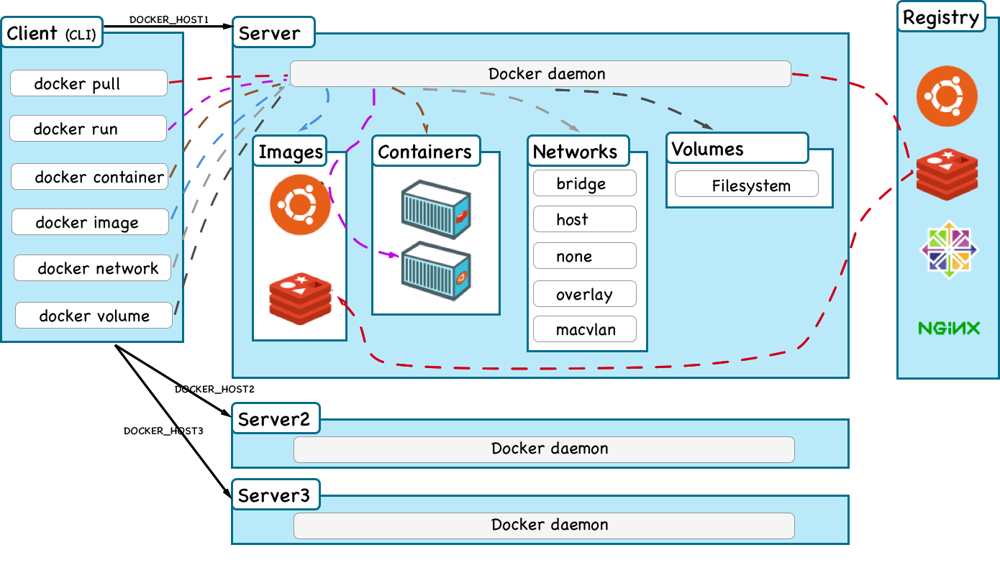
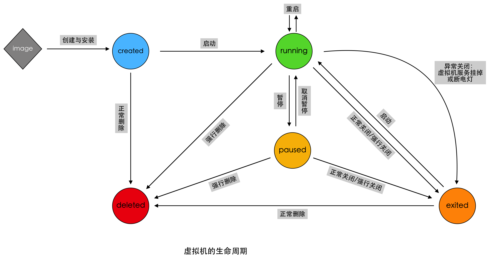
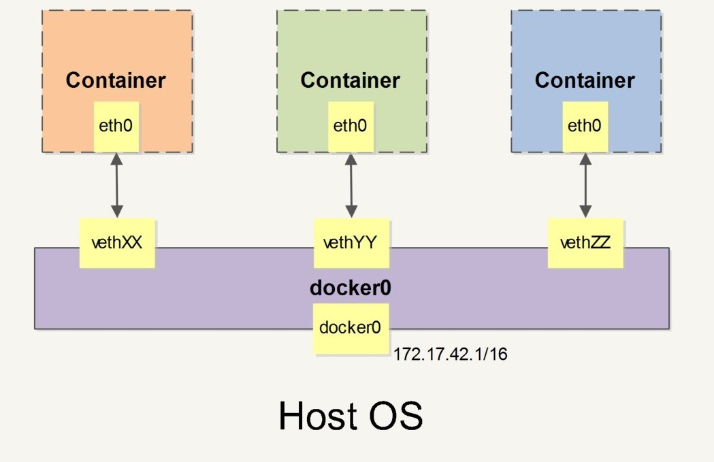

# Docker

## 整体架构

- docker daemon: 实现镜像, 容器, 网络, 卷等模块,
- docker CLI:  通过RESTful API与docker daemon通信.
- registry: 镜像仓库.

## 核心组成

### 镜像 Image

> 从根本上解决了打包的难题

### 容器 Container

### 网络 Network

> bridge, host, overlay

- bridge: 
- host: 和主机共享网络栈.
- overlay: 集群环境下使用.
    - 依靠`key-value`存储服务.
    - 集群中每台机器的hostname唯一.

### 数据卷 Volume

