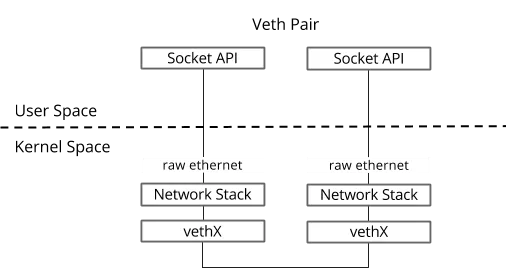

# Docker使用的底层技术

> **不同平台docker所使用的技术不同, 对于windows和Mac, 是基于虚拟化实现. **本这里讨论的是Linux Docker相关技术.
>
> 核心原理: 1.启动Linux Namesapve配置, 实现隔离.2.设置指定的Cgroups参数, 实现资源管控.3.切换进程根目录(Cahange Root), 实现

## 1.网络

> 参考: [猿大白](https://ctimbai.github.io/) [Linux虚拟网络设备之bridge(桥)](https://segmentfault.com/a/1190000009491002)
>
> 

### 1.veth pair

> 虚拟的以太网设备, veth通常成对创建并且之间相互连接, 可以作为**连接不同网络命名空间之间的桥梁: 一端放在一个网络命名空间中, 另一端放到另一个网络命名空间中, 从而允许两个命名空间相互通信**.
>
> 创建: `ip link add <p1-name> type veth peer name <p2-name>`

- 创建时指定命名空间: `ip link add <p1-name> netns <p1-ns> type veth peer <p2-name> netns <p2-ns>`
- 将veth设置放入指定命名空间: `ip link set <p2-name> netns <p2-ns>`

### 2.bridge

> 网桥: 负责将网络的多个网段在数据链路层连接起来, 有别于路由, 路由允许多个网络通信但又保持隔离, 而网桥则是将两个独立的网络连接起来, 就如同一个网络.
>
> 虚拟网桥: 一个虚拟的网络桥接器.

- 创建名为br0的网桥
    - `ip link add name br0 type bridge`
    - `ip link set br0 up`
    - 此时的网络结构图
    - 
- 将`veth`设备与`vridge`相连
    - `ip link set dev veth0 master br0`
    - 断开: `ip link set dev veth0  nomaster`

### 3.NAT

> 网络地址转换

- SNAT: 改变数据包的源地址. 内部网络访问公网时, 出口路由做SNAT.
    - 通过连接跟踪, 用"源/目的IP+源/目的端口" 标识唯一链接, 就可以接收返回消息.
- DNAT: 改变数据包的目标地址.
    - 当外部访问进来, 外网网口会通过`DANT`将公网IP地址转换为私网IP, 以此访问私网服务器.
- `iptables`:
    - SNAT: `iptables -t nat -A -s 私网IP -j Snat --to-source 外网IP`
    - DNAT: `iptables -t nat -A -PREROUTING -d 外网IP -j Dnat --to-destination 私网IP`

### 4.tap/tun

> 虚拟网络设备, 配合对应的字符设备驱动, 网卡驱动进行工作.

- 字符驱动: **负责内核空间和用户空间的数据传递**. 模拟了物理链路的数据收发(可以**连接虚拟机环境, 类似物理网口**.)
- 网卡驱动: 负责协议栈的处理.

## 2.Linux Namespace

> 参考: [Docker基础技术: Linux Namespace](https://coolshell.cn/articles/17010.html)
>
> 主要用于实现**进程,网络, ipc, 等资源的隔离**.

| namespace | 系统调用参数  | 隔离内容                |
| --------- | ------------- | ----------------------- |
| UTS       | CLONE_NEWUTS  | 主机名和域名            |
| IPC       | CLONE_NEWIPC  | 信号量                  |
| PID       | CLONE_NEWPID  | 进程编号                |
| Network   | CLONE_NEWNET  | 网络设备, 网络栈,端口号 |
| Mount     | CLONE_NEWNS   | 挂载点                  |
| User      | CLONE_NEWUSER | 用户和用户组            |

- `int clone(int (*fn)(void *), void *stack, int flags, void *arg, ...`
    - 创建新线程时, 通过`flags`参数, 隔离资源.
    - 例如: `CLONE_NEWPID, CLONE_NEWNET`:
-  

## 3.Linux Cgroups

> 参考: [Docker基础技术: Linux Cgroup](https://coolshell.cn/articles/17049.html)
>
> 就是限制一个进程组能够使用的资源上限，包括 CPU、内存、磁盘、网络带宽等等, Cgroups还能够对进程设置优先级, 审计, 以及将进程挂起和恢复等.
>
> 主要提供: 
>
> - **Resource limitation**: 限制资源使用，比如内存使用上限以及文件系统的缓存限制。
> - **Prioritization**: 优先级控制，比如：CPU利用和磁盘IO吞吐。
> - **Accounting**: 一些审计或一些统计，主要目的是为了计费。
> - **Control**: 挂起进程，恢复执行进程。

- Linux中, Cgroups 给用户暴露出来的操作接口时文件系统. `/sys/fs/cgroup`
    - cgroup有若干**子系统**, 对应录下的一个文件夹, 例如`cpu, memorry, net_cls, blkio(块设备IO)`,等.
    - **子系统下的目录**, 称为控制组.
    - 

## 4.UFS/AUFS/Overlay2

> 容器启动时: 通过Namespace设置挂载隔离, 切换根目录(挂载镜像中的目录). 但是共用操作系统的内核(bootfs).
>
> 镜像中包含`rootfs`, 相当于封装了应用运行的所有依赖.
>
> 通过引入`layer`的概念, 复用已有的文件系统, 在此基础上的修改作为一个新的层.
>
> dockers存储支持: `OVERLAY2, AUFS, ZFS`等多种文件系统. 可以通过`docker info|grep Storage`查看.
>

### 1.rootfs vs bootfs

- `bootfs`:
    - 包含`boot loader`和`kernel`, 各个发行版本没有区别.
    - Docker容器共享主机系统的`bootfs`.

- `rootfs`: 
    - 针对特定的操作系统的架构, 一种实现形式, 通俗讲就是`/, /etc, /sbin, /usr/bin`等诸如此类有特殊含义和规定的文件目录.
    - 内核启动时`mount`的第一个文件系统, 用于存储整个目录树.
    - 每个容器有自己的`rootfs`, 基于不同的Linux发行版本基础镜像.

### 2.联合文件系统 Union File System

> 将不同位置的目录**联合挂载到同一目录下**.

- - 

### 1.Overlay

- 类似aufs(Advance UnioFS)的一种堆叠文件系统,  仅将原来底层文件系统中不同的目录进行"合并", 然后向用户呈现. 允许临时修改只读文件和文件夹

- `Lower`目录都是只读;
- 通过`OverlayFS`访问文件, 首先从`Upper`层目录检索, 如果不存在, 则向`Lower`层检索.
- 删除会直接在`Upper`层中删除, 并创建一个`whiteout`文件;
- 通过`docker image inspect {image}`可以看到镜像的分层信息

- - 

## 其他参考

[Docker 核心技术与实现原理](https://draveness.me/docker/)

