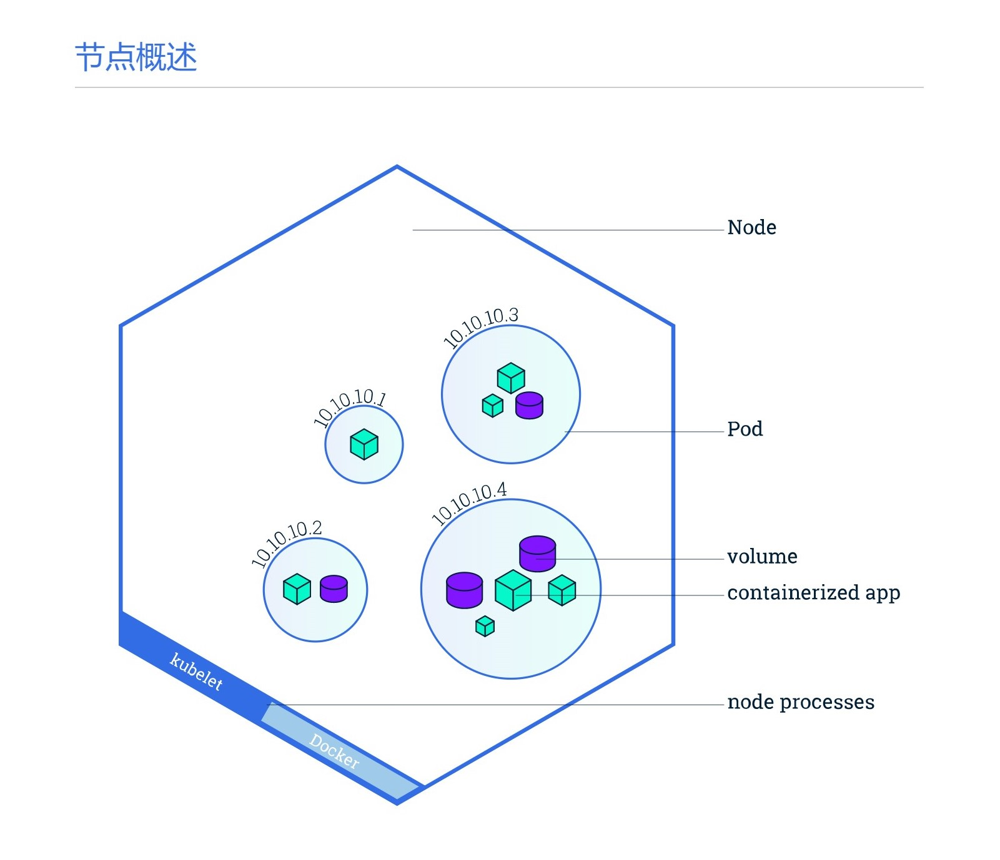
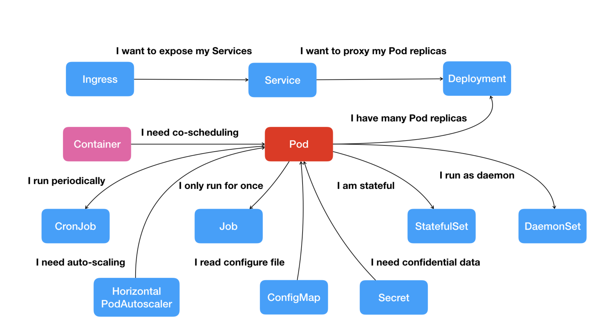

# Kubernetes

> Kubernetes项目要解决的问题: **运行在大规模集群中的各种任务之间，实际上存在着各种各样的关系, 这些关系的处理，才是作业编排和管理系统最困难的地方**

## 1.整体架构

> 一个Kubernetes系统, 通常称之为Kubernetes集群. 由一个Master节点, 和若干Node节点组成.


### 1.Master

> 负责协调集群中的所有活动

- `kube-apiserver`: 提供整个系统对外的HTTP接口.
-  `kube-scheduler`: Pod调度, 决定Pod放在哪一个Node上运行.
- `controller-manager`: 一组控制器, Node Controller, Replication Controller, Endpoints Controller...
- `etcd`: 分布式存储, 负责保存集群的配置信息和资源的状态. 

### 2.Node

> 维护Pod, 使用API和Master通信, 指单台服务器(物理或者虚拟)



- Kubelet: 负责容器的管理.
- kube-proxy: 维护节点上的网络规则, 允许从集群内部或外部的网络会话与Pod通信.
- Pod: 可以在Kubernetes中创建和管理的, 最小的可部署计算单元. 
    - 一组容器以及共享的资源(网络资源, 空间资源等), 容器间时相对紧密的耦合在一起的. 


## 2.概念



### 1.Pod

- 多个关联的容器和一些共用资源.

- 为什么需要Pod?
    - 有些任务需要一组进程共同完成, 进程间相互会直接发生文件交换, 使用`localhost`或本地`socket`通信, 会发生频繁的远程调用, 需要共享某些Namespace.
    - Pod是Kubernetes的原子调度单位.
    - Pod就是一组共享了某些资源的容器.
    - Pod中的容器, 通过`Infra`容器关联在一起. Pod的生命周期只和Infra容器一致.

### 2.Deployment

> 部署的对象, 用户负责描述Deployment中的目标状态(声明式更新). Deployment控制器实施更新, 使其变更为期望状态.

- 例如, 下面的Deployment负责启动三个`nginx`Pods:

```yaml
apiVersion: apps/v1
kind: Deployment
metadata:
  name: nginx-deployment
  labels:
    app: nginx
spec:
  replicas: 3
  selector:
    matchLabels:
      app: nginx
  template:
    metadata:
      labels:
        app: nginx
    spec:
      containers:
      - name: nginx
        image: nginx:1.14.2
        ports:
        - containerPort: 80
```

### 3.Ingress

> Ingress对集群中`service`的外部访问进行管理的API对象. 可以提供负载均衡

- 例如一个最小的`Ingress`资源:

```yaml
apiVersion: networking.k8s.io/v1
kind: Ingress
metadata:
  name: minimal-ingress
  annotations:
    nginx.ingress.kubernetes.io/rewrite-target: /
spec:
  rules:
  - http:
      paths:
      - path: /testpath
        pathType: Prefix
        backend:
          service:
            name: test
            port:
              number: 80
```

