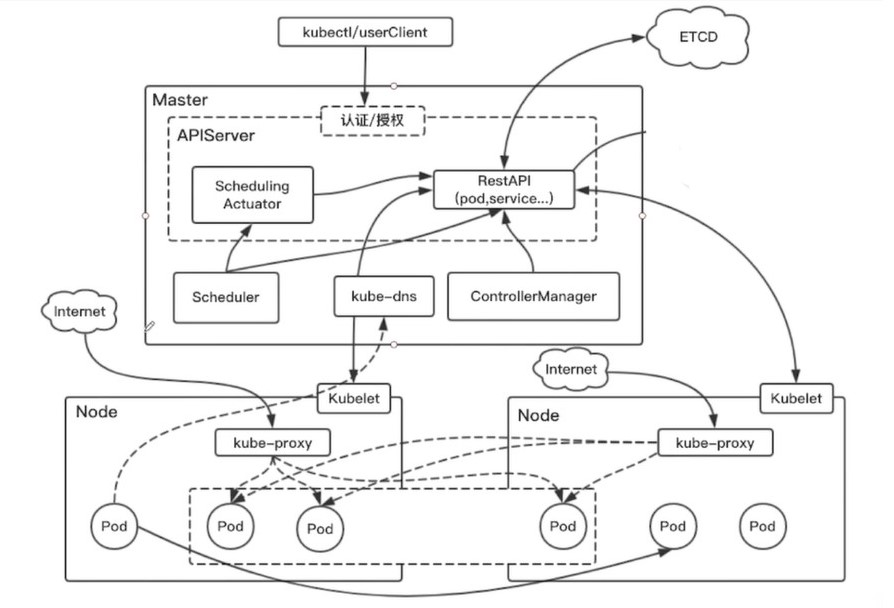
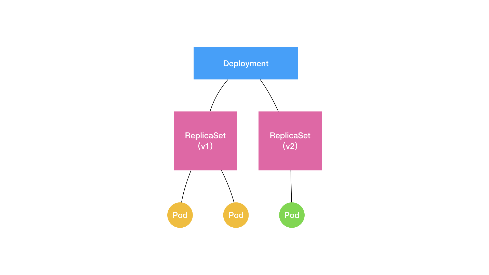

# Kubernetes

> Kubernetes项目要解决的问题: **运行在大规模集群中的各种任务之间，实际上存在着各种各样的关系, 这些关系的处理，才是作业编排和管理系统最困难的地方**
>
> Kubernetes提供了一个框架, 可以弹性的运行分布式系统, 它提供**服务发现和负载平衡**, **自动部署和回滚**, **自我修复**,**密钥和配置管理**.

## 1.整体架构

> 一个Kubernetes系统, 通常称之为Kubernetes集群. 由一个Master节点, 和若干Node节点组成.




### 1.Master(Control Plane)

> 集群的控制节点, 负责协调集群中的所有活动

- `kube-apiserver`: 作为Kubernetes系统的入口, 以REST API接口方式提供给外部客户端和内部组件.
- `kube-scheduler`: Pod调度, 决定Pod放在哪一个Node上运行.
    -  根据预选规则, 选出合适的主机.
    -  根据优选规则打分, 选择合适的Node.
- `controller-manager`: 一组控制器, `Node Controller`, `Replication Controller`, `Endpoints Controller`等
    - 维护对应的`Kuberenetes对象`
- `etcd`: 分布式存储系统, 负责保存`kube-apiserver`维护的数据. 

### 2.Node

> 集群中, Master节点之外的物理节点. 工作负载节点, 使用API和Master通信.


- `kubelet`: 负责Pod的管理, 从`kube-apiserver`接收指令, 监控容器状态并汇报给`kube-apiserver`.
- `kube-proxy`: 维护节点上的网络规则, 负责Pod的负载均衡和服务发现(Service的落地).
- `continue-runtime`: 容器运行时, 负责运行容器.

## 2.设计理念

- API设计原则: 
    - 1.声明式API(用户期望的系统应该是什么样子), 对于重复操作是稳定的.
    - 2.API 以业务基础, 操作意图出发, 设计API.

- 控制机设计原则:
    - 假定任何错误的可能并对错误进行处理.
    - 每个模块都可以在出错后自动恢复.
    - 每个模块都考虑服务降级(高级功能, 基本功能).

### 1.控制器模型

> 控制机设计原则:
>
> - 假定任何错误的可能并对错误进行处理.
>
> - 每个模块都可以在出错后自动恢复.
>
> - 每个模块都考虑服务降级(高级功能, 基本功能).

- **控制循环(control loop)/Reconcile Loop/Sync loop**

```
for {
	实际状态 := 获取集群中对象 X 的实际状态（Actual State）
	期望状态 := 获取集群中对象 X 的期望状态（Desired State）
	if 实际状态 == 期望状态{
		什么都不做
} else {
		执行编排动作，将实际状态调整为期望状态
	}
}
```

- 控制器本身就是一个对象(例如Deployment) , 设计原理就是: **用一种对象管理另一种对象**

### 2.声明式API

- 我们只需要提交一个定义好的API对象来"声明"所期望的状态是什么样子.
- 允许有多个API写端, 以**PATCH的方式对API对象进行修改**.
- Kubernetes基于对API对象的增,删,改,查, 在完全无需外界干预的情况下,完成对"实际状体"和期望状态的调谐(Reconcile)过程.

### 3.CNI, CSI, CRI

> CNI: Container Networking Interface
>
> CSI: Container Storage Interface
>
> CRI: Container Runtime interface


## 3.Kubernetes对象

> 在 Kubernetes 系统中，*Kubernetes 对象* 是持久化的实体。 Kubernetes 使用这些实体去表示整个集群的状态：
>
> - 哪些容器化应用在运行（以及在哪些节点上）
> - 可以被应用使用的资源
> - 关于应用运行时表现的策略，比如重启策略、升级策略，以及容错策略


### 1.对象的描述和维护

- Kubernetes对象的描述

```yaml
# 必要, Kubernetes API 的版本
apiVersion: apps/v1

# 必要, 对象类型, 如: Pod, Deployment, Ingrees, Service...
kind: Deployment

# 必要, 对象元数据信息, 例如name, uid, labels等信息
metadata:
  name: nginx-deployment
  labels:
   key1: value1
   key2: value2

# 必要, 对象规格, 内容根据具体对象而定
spec:
  selector:
    matchLabels:
      app: nginx
  replicas: 2 
  template:
    metadata:
      labels:
        app: nginx
    spec:
      containers:
      - name: nginx
        image: nginx:1.14.2
        ports:
        - containerPort: 80
```

- 标签(Labels)和标签的选择算:
    - Labels:  附加到对象上的键值对, 用于指定对象的标识属性, 用于查询, 监听对象.
    - 标签的选择运算: 客户端/用户可以识别一组对象(满足运算条件的标签)
        - `=, !=` : `kubectl get pods -l environment=production`
        - `in, notin, exists`: `kubectl get pods -l 'environment in (production)`  
- 对象管理:
    - 命令式管理: `kubectl run/expose/... xx`;
    - 对象配置管理(命令式): `kubectl create/replace/delete -f xxx.yaml`
    - **对象配置管理(声明式): `kubectl apply -f xxx.yaml`**

### 2.Pod

> **Pod，实际上是在扮演传统基础设施里“虚拟机”的角色；而容器，则是这个虚拟机里运行的用户程序**

- 只是一个逻辑概念, 通常不需要直接创建, 而是使用Deployment或Job这类工作负载来创建Pod.
    - 类似的工作负载资源有: Deployment, StatefulSet, DaemonSet. 
    - 工作负载会使用负载对象的`PodTemplate`来生产实际的Pod.

- 多个关联的容器和一些共用资源. 就是Kubernetes世界的一个应用.

- 为什么需要Pod?
    - 有些任务需要一组进程共同完成, 进程间相互会直接发生文件交换, 使用`localhost`或本地`socket`通信, 会发生频繁的远程调用, 需要共享某些Namespace.
    - Pod是Kubernetes的原子调度单位.
    - Pod就是一组共享了某些资源的容器.
    - Pod中的容器, 通过`Infra`容器关联在一起. Pod的生命周期只和Infra容器一致.

```yaml
apiVersion: v1
kind: Pod
metadata:
  name: myapp-pod
  labels:
    app: myapp
spec:
  containers:
  - name: myapp-container
    image: busybox
    command: ['sh', '-c', 'echo The app is running! && sleep 3600']
  initContainers:
  - name: init-myservice
    image: busybox
    command: ['sh', '-c', "until nslookup myservice.$(cat /var/run/secrets/kubernetes.io/serviceaccount/namespace).svc.cluster.local; do echo waiting for myservice; sleep 2; done"]
  - name: init-mydb
    image: busybox
    command: ['sh', '-c', "until nslookup mydb.$(cat /var/run/secrets/kubernetes.io/serviceaccount/namespace).svc.cluster.local; do echo waiting for mydb; sleep 2; done"]
```

#### 1.生命周期

- `Pending` --> `Running` --> `Successed/Failed`
- Pod生命周期内只会被调度一次. 一旦被分配到节点上, Pod会运行到停止. Pod自身不具有自愈能力.

#### 2.InitContainer

> 比`spec.containers`定义的用户容器先启动. 并且会按照顺序逐一启动.

- 每个Init容器会在网络和数据卷初始化之后按顺序启动.**每个Init容器成功退出后才会启动下一个Init容器**.

#### 3.重要字段

- `spec.restartPolicy`: 重启策略. `Always|OnFailure|Never`.

- `spec.nodeSelector`: 将Pod调度到指定的node上.
- `spec.hostALiases`: 定义Pod的hosts文件内容.
- `spec.containers`: 容器信息.

#### 4.健康检查

### 2.Deployment

> 定义多副本应用(多副本Pod)的对象. ,用户负责描述Deployment中的目标状态(声明式更新). Deployment控制器实施更新, 使其变更为期望状态.
>
> Deployment还负责在Pod定义发生变化时, 对每个副本进行滚动更新.

- 例如, 下面的Deployment负责启动三个`nginx`Pods:

```yaml
apiVersion: apps/v1
kind: Deployment

# metadata: 对象的元数据
metadata:
  name: nginx-deployment
  # 通过 labels 过滤出它所关心的被控制对象. 会将所有携带"app:nginx" 标签的Pod识别为被管理对象. 
  labels:
    app: nginx
    
# spec: 存放对象特有的数据
spec:
  # replicas 副本数量
  replicas: 3
  selector:
    matchLabels:
      app: nginx
  template:
    metadata:
      labels:
        app: nginx
    spec:
      containers:
      - name: nginx
        image: nginx:1.14.2
        ports:
        - containerPort: 80
```

### 3.ReplicaSet

> 维护一组在任何时候都处于运行状态的Pod副本的稳定集合. 通常用于保证给定数量, 完全相同的Pod的可用性.

- Deployment是一个更高级的概念, 管理ReplicaSet, 通常使用Deployment而不是ReplicaSet.
- Deployment通过ReplicaSet的个数描述应用版本, 然后通过ReplicaSet的属性, 保证Pod副本数量.
    - Deployment 控制 ReplicaSet版本.
    - ReplicaSet控制Pod数量.




### 3.Ingress

> Ingress对集群中`service`的外部访问进行管理的API对象, 为了代理不同后端的Service而设置的负载均衡服务.
>
> 简单粗暴**所谓Ingress就是Service的"Service"**.

- 例如一个最小的`Ingress`资源:

```yaml
apiVersion: networking.k8s.io/v1
kind: Ingress
metadata:
  name: minimal-ingress

spec:
  # IngressRule, key
  rules:
  - http:
      paths:
      - path: /testpath
        pathType: Prefix
        backend:
          service:
            name: test
            port:
              number: 80
```

### 4.Service

> 将一组Pod上应用程序公开为网络服务的抽象.

- **为什么需要`Service`?**
    - 每个Pod都有自己的IP地址, 但是Pod是**非永久性资源, 存在动态创建和销毁**. 那么, 一组Pod如何为其他的Pod提供持续服务? 其他Pod如何感知服务IP? 所以, 需要引入`Services`概念.
    - `service`可以对多个Pod进行包括, 负责负载均衡.

```yaml
apiVersion: v1
kind: Service
metadata:
  name: my-service
spec:
  selector:
    app: MyApp
  ports:
    - protocol: TCP
      port: 80
      targetPort: 9376
```

### 5.Secret

> 将Pod想要访问的加密数据, 存放到Etcd中, 然后就可以通过在Pod的容器里挂载Volume的方式, 访问到这些Secret.

### 6.ConfigMap

> 用于将非机密性数据保存到键值对中, 使用时, 可以将其作为**环境变量, 命令行参数, 存储在卷中的配置文件**.

- ```yaml
    apiVersion: v1
    kind: ConfigMap
    metadata:
      name: game-demo
    data:
      # 类属性键；每一个键都映射到一个简单的值
      player_initial_lives: "3"
      ui_properties_file_name: "user-interface.properties"
    
      # 类文件键
      game.properties: |
        enemy.types=aliens,monsters
        player.maximum-lives=5    
      user-interface.properties: |
        color.good=purple
        color.bad=yellow
        allow.textmode=true    
    ```

- 使用:

    - 在容器 命令和参数内.

    - 容器的环境变量

    - 在只读卷中添加一个文件, 让应用来读.

    - ```yaml
              env:
                # 定义环境变量
                - name: PLAYER_INITIAL_LIVES    # 环境变量名
                  valueFrom:
                    configMapKeyRef:
                      name: game-demo           # 来自 game-demo 这个 ConfigMap
                      key: player_initial_lives # 需要取值的键
                - name: UI_PROPERTIES_FILE_NAME # 环境变量名
                  valueFrom:
                    configMapKeyRef:
                      name: game-demo
                      key: ui_properties_file_name
              volumeMounts:
              - name: config
                mountPath: "/config"
                readOnly: true
        ```

    - 

## 4.CNI

## 5.安全

