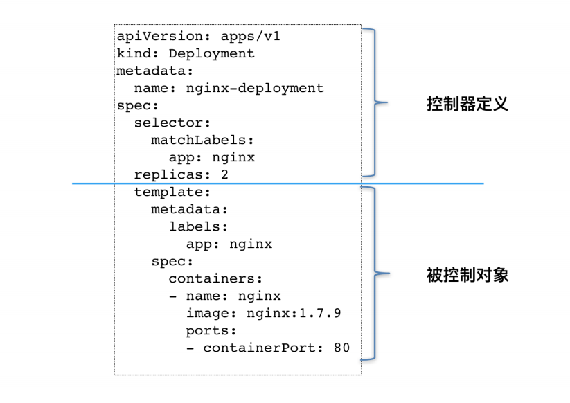

# 控制器

> **控制器**: 通过监控集群的状态, 并致力于将**当前状态**转变为**期望状态**. 控制器使用一种**特定类型资源(工作负载)作为期望状态**,  控制器管理控制另外一种类型的资源向它的期望状态演化.
>
> **资源**: Kubernetes API中的一个端点, 其中存储的是某个类别的API对象 的一个集合.
>
> **定制资源**: 可以通过动态注册的方式治安运行中的集群内出现或者消失. 一旦安装, 用户可以通过`kubect`来创建和访问其中的对象.
>
> **定制控制器**: 定制资源只能存储结构化的数据, 与 定制控制器结合, 才能提供真正的 **声明式API**
>
> **Operator模式**: 利用CRD, 来描述想要部署的"有状态应用", 然后在自定义控制器里, 根据自定义API对象的变化, 完成具体的部署和运维工作.

## 控制循环

```go
for {
  实际状态 := 获取集群中对象 X 的实际状态(Actual State)
  期望状态 := 获取集群中对象 X 的期望状态(Desired State)
  if 实际状态 != 期望状态 {
      执行编排动作, 将实际状态调整为期望状态
  }
}
```

- 实际状态: Kubernetes集群本身, 
- 期望状态: 来源于用户提交的YAML文件.
- 被控制对象: 通过`spec.selector`进行查找, 一般通过`spec.template`定义.

