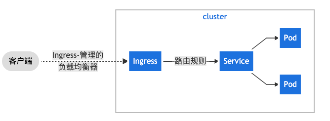

# 网络

## Sercvice

## Ingress

> 全局的, 为了代理不同后端Service而设置的负载均衡服务.
>
> **ingress就是Service的"Service"**




```yaml
apiVersion: networking.k8s.io/v1
kind: Ingress
metadata:
  name: minimal-ingress
  annotations:							  # 经常使用注解配置一些Ingress控制器要求的选项
    nginx.ingress.kubernetes.io/rewrite-target: /
spec:
  rules:                      # IngressRule 
  - http:
      paths:
      - path: /testpath       # 可以理解为 一个path对应一个后端Service
        pathType: Prefix
        backend:
          service:
            name: test       # 对应的serviceName
            port:
              number: 80
```

### 1.Ingress Controller

> Ingress资源工作, 集群必须有一个正在运行的Ingress控制器

[nginx-ingress-controller](https://docs.nginx.com/nginx-ingress-controller/overview/)

## NetworkPolicy

> 实现网络隔离, NetworkPolicy 实际上只是宿主机上的一系列 iptables 规则