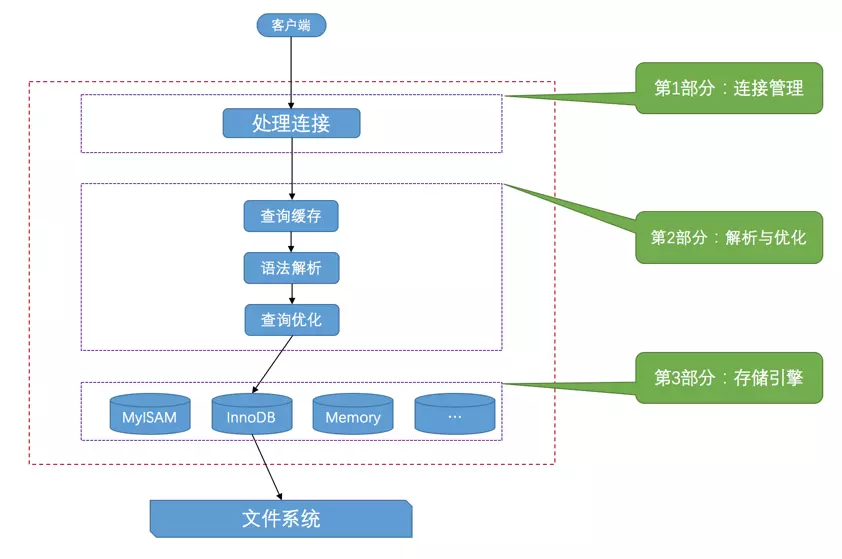

## 1.基础及及架构

### 1.MySQL server

- 客户端进程向服务端进程发送一段文本(SQL语句), 服务器进程处理后再向客户端进程发送一段文本(处理结果); 
- 服务端处理可以分为三部分:
  - 连接管理: MySQL服务器会为每一个连接进来的客户端分配一个线程;
  - 解析优化: 包括语法解析(编译), 查询优化(外连接转换为内连接、表达式简化、子查询转为连接);
  - 存储引擎: 对数据的存储和提取操作的封装



### 2.常用的存储引擎

- `InnoDB`: 具备外键, 支持事务和部分事务回滚(Savepoints), 支持分布式事务(XA)
- `MyISAM`: 占用空间小, 处理速度快, 但不支持事务完整性和并发;
- `Memory`: 存储于内存中, 默认使用哈希索引, 速度快.

### 3.系统变量和状态变量

> 系统变量: 配置MySQL服务器的运行环境, 可以通过**配置文件**, **启动选项**, 或运行时进行配置;
>
> 状态变量: 监控MySQL服务器的运行状态;

- 查看系统变量: `show variables;` 或者`show variables like 'log%';`
  - 优先显示会话级别变量, 不存在则显示全局变量;
  - 可以使用`show global variables;`指定显示全局变量;
- 通过`set [GLOBAL|SESSION] variable_name = value`;
  - 例如`SET GLOBAL sort_buffer_size=value; 或 SET @@global.sort_buffer_size=value;`
- 重要变量:
  - `max_connections`: 最大连接数;
  - `auto_increment_increment`: 自增增量;
  - `auto_increment_offset`: 起始自增点;
- 查看状态变量: `show status`或者`show status like 'Threads%';`

### 4.服务端启动配置

- 默认会读取响应目录下的`my.cnf`文件;
- `mysqld_save`: 会间接调用`mysqld`, 在启动后监控`mysqld`的运行情况;
- 使用`--defaults-file`指定配置文件;

### 5.字符编码

- 使用`show charset`查看支持的字符编码;
- 常用字符编码:
  - `utf8bm4`: 正宗`utf-8`编码, 

### 6.数据类型

- 存储数据最小的数据类型通常更好, 但要确保没有低估需要存储的值的范围;
- 简单更好; 简单数据类型通常需要更少的CPU周期;
- 尽量避免NULL, MySQL难以优化包含NULL的列;

- 常用数据类型: `INT, FLOAT, DOUBLE, DATA, TIME, CHAR, VARCHAR, TEXT...`
    - `VARCHAR`: 可变长字符串, 适用于列的最大长度比平均长度大很多, 列的更新很少的数据; 频繁更新会导致碎片化;
    - `CHAR`: 定长, 对于经常变更的数据也不容易产生碎片; 存储空间上比`VARCHAR`更有效率;
    - `BLOB`: 存储的是二进制数据, 没有排序规则或字符集;
    - `TEXT`: 存储的是字符


## 2.库和表操作

> 帮助使用：
>
> - 按层次看帮助：`mysql>? contents` 会按分类列出项，然后可以再选择感兴趣的方向
>
> - 直接快速查询：`mysql>? show`

### 1.数据库操作

- 创建: `CREATE DATABASE 数据库名;`

- 查看：`SHOW {DATABASES|SCHEMAS} ` ；

- 修改：`ALTER {DATABASE|SCHEMAS} [数据库名] [DEFAULT] CHARACTER SET [=] charset_name;`

- 删除：`DROP {DATABASE|SCHEMA} [IF EXISTS] 数据库名;`


- 使用数据库：`USE 数据库名;`

### 2.表定义操作

- 创建：`CREATE TABLE 表名 (字段名1 属性, 字段名2 属性, ...);`
  - 设置主键: `PRIMARY KEY`;
  - 设置非空: `NOT NULL`;
  - 唯一约束: `UNIQUE`;
  - 设置外键: `CONSTRAINT 外键别名 FOREIGN KEY (字段1, 字段2) REFERENCES 表明(字段名1, 字段名2)`;
  - 设置自增: `AUTO_INCREMENT`;
    - 默认值: `DEFAULT 默认值`;
- 查看：`SHOW TABLES;`
  - 查看名为`tb_name`的数据表的详细结构：`SHOW COLUMNS FROM 表名;` | `DESCRIBE 表名;`或者`EXPLAIN 表名;`
  - 查看建表详细信息: `SHOW CREATE TABLE 表名;`
- 修改数据表内容：`ALTER TABLE 表名 ...`
  - 重命名: `... RENAME 新表名`
  - 修改字段:
    - 修改字段数据类型和索引: `... MODIFY 属性名 数据类型 约束 类型 [FIRST|AFTER 字段] ;`
    - 修改字段名称: `... CHANGE 旧字段名 新字段名 属性;`
  - 添加字段:
    - 添加：`... ADD 字段名 属性 [FIRST|AFTER col_name]`
    - 添加多列：`... ADD (字段名1 属性, 字段名2 属性);`
  - 删除字段：
    - `... DROP col_name;`
  - 删除约束:
    - 删除主键约束：`... DROP PRIMARY KEY;`
    - 删除外键约束: `... DROP FOREIGN KEY 外键别名;`, 未指定外键别名会自动生成,  请查看建表信息`SHOW CREATE TABLE 表名`
  - `DROP`和`ADD`可以混用，用`,`隔开即可；
  - 修改表的存储引擎: `... ENGINE=存储引擎名`

- 删除: `DROP TABLE 表名`

## 3.数据增删改查

### 1.数据增删改

- 插入:
  - `INSERT [INTO] 表名 VALUES (值1, 值2...),((值1, 值2...))` ：给所有字段插入一组或多组值;
  - `INSERT [INTO] 表名 (字段1, 字段2) VALUES (值1, 值2...),((值1, 值2...));`: 给字段字段插入一组或多住值;
  - `INSERT [INTO] 表名 SET 字段1=值1,字段2=值2，...;` 每次只能插入一组信息；与第一种的区别：此种方式可以使用子查询； 
  - `INSERT [INTO] 表名 (字段1, 字段2...)] SELECT ...;` 可将查询结果插入到指定数据表中；
- 从文件中加载数据`LOAD DATA INFILE`：
  - `LOAT DATA INFILE '文件路径' INTO TABLE tab_name [LINES TERMINATED BY '\r\n'];`
- 更新：
  - `UPDATE 表名 SET 字段1=值1, 字段2=值2,...WHERE 条件;`
- 删除：
  - `DELETE FROM 表名 WHERE 条件;` 

### 2.表查找操作

- 基本查询:

  ```mysql
  SELECT [DISTINCT] 属性1, ...FROM 表名
  [
    [WHERE 条件1]
    [GROUP BY 属性1 [HAVING 条件2]]
    [ORDER BY 属性2 [ASC|DESC],...]
  ]
  ```

- `WHERE`子句: 

  - 大小比较: `=, <, <=, >, >=, !=`
  -  集合`IN|NOT IN`:  `... WHERE id IN (1, 5, 10) ;`
  - 范围`[NOT] BETWEEN AND`:  `... WHERE id BETWEEN 1 and 10;`
  - 匹配字符`[NOT] LIKE`: `... WHERE name LIKE 'l%';`
    -  `%`: 任意长度字符串, 长度可以为0;
    - `_`: 匹配单个字符;
  - 空值`IS [NOT] NULL`
  - 多个条件`AND, OR`: `WHERE id=1 OR name='test';`

- 去重`DISTINCT `:  `SELECT DISTINCT name FROM product;`

- 排序`ORDER BY 字段 [ASC|DESC]`: 安照指定字段的升序或降序排序; 

- 别名`... 字段 AS 字段别名 FROM ...;`

- 分组 `GROUP BY` ：
  - 通常伴随着对另外一些列进行聚合运算, 如`sum, avg, max, min`等;  `SELECT 字段2, max(字段1) from 表名 GROUP BY 字段2;` 
  - 加条件限制`HAVING` : `...HAVING SUM(xxx)>100`, 注意, `WHERE`用于表和视图, `HAVING`用于分组;

- 限制返回数量`LIMIT` ：
  - `... LIMIT 数量` : 仅返回指定数量的查询结果； 
  - `... LIMIT 初始位置 数量` : 返回从指定位置开始的指定数量结果;

- 聚合(集合)函数：`COUNT(),SUM(),AVG(),MAX(),MIN();`

### 3.连接查询和子查询


#### 1.连接查询

> 连接查询: 将两个或两个以上的表按某个条件连接, 从中查询数据;

- 连接：`SELECT * FROM 表1 [连接形式] 表2 ON 表1.字段1=表2.字段2 WHERE 条件;`  
  - 一般用`ON`关键字来设定连接条件，用`WHERE`关键字进行结果及记录的过滤。
- 连接类型：内连接、左外连接、右外连接；
  - 内连接`JOIN`: 仅显示符合连接条件的记录，即交集部分；
  - 左外连接`LEFT JOIN`:从左表那里返回所有的行 ;
  - 右外连接 `RIGHT JOIN`:从右表那里返回所有的行;


- 内连接的两种写法:

  ```sql
  # 写法1
  SELECT a.字段1, b.字段2 
  FROM 表1 AS a, 表2 AS b 
  WHERE 表1.字段1=表2.字段3;
   
  #写法2
  SELECT a.字段1, b.字段2 
  FROM 表1 AS a JOIN 表2 AS b 
  ON 表1.字段1=表2.字段3
  WHERE 条件;
  
  ```

- 多表连接：

  ```SQL
   SELECT A.xxx, b.xxx 
   FROM A
   JOIN (B, C)
   ON A.xx = B.xx AND|&& B.xx=C.xx
   WHERE =...
  ```
#### 2.子查询

> 子查询（subquery）指出现在其他SQL语句(增删改查)内的SELECT子句，用小括号包围；子查询外层可以是：SELECT、INSERT、UPDATE、SET、或DO；

- 三种引发子查询的方式：
  - `>, <,<= ,>=` 比较运算符引起的子查询：可以用`ANY, SOME, ALL`修饰比较运算符号，符合其中的（ANY，SOME）一个，所有（ALL）；
  - `[NOT] IN`引发的子查询：`... IN(SELECT ...);`
  - `[NOT] EXISTS`引发的子查询：如果子查询返回任何行，`EXISTS`将返回TRUE；
- 将查询结果写入数据表：`INSERT [INTO] tbl_name [(col_name,..)] SELECT ...`
- 多表更新：参照另外的表更新本表的记录；`UPDATE table_references SET`
- `CREATE...SELECT`:创建数据表的同时，将查询结果写入到数据表，

## 4.索引

> 索引: 存储引擎用于快速找到记录的一种数据结构; 存储引擎会先在索引中找到对应值, 然后根据匹配的索引记录找到对应的数据行.
>
> 参考: **<<高性能MySQL>> 第五章**

### 1.索引类型

- B-Tree索引: 使用B-Tree(B+Tree)数据结构来存储数据;

    

- 哈希索引: 基于哈希表, 只有精确匹配的查询才有效; 只有`Memory`引擎支持;

- 空间数据索引: 基于R-Tree, `MyISAM`支持, 可以用于地理数据存储;

- 全文索引: 查找的是文本中的关键词, 而不是直接比较索引中的值;

### 2.索引概述

- 优点:
    - 减少了服务器需要扫描的数据量;
    - 避免排序和临时表;
    - 将随机I/O变为顺序I/O;

- 查看索引信息：`SHOW {INDEX|KEYS} FORM tab_name;`
- 对某个表的某列建立索引：
  - `ALTER TABLE tab_name ADD INDEX index_name(col_name);` 或者
  - `CREATE INDEX index_name ON tab_name(col_name);`


### 3.高效的索引策略

- 索引不能是表达式的一部分: 如`...WHERE actor_id + 1=5;`

- 前缀索引和索引选择性:

    - 对很长的字符列建立索引会使得索引变得大且慢,  通常可以索引开始的部分字符;
    - 同理, 部分情况(如前缀相同)也可以对后缀建立索引;

- 多列索引

    - >多个列上建立独立索引, 在查询多个索引条件时往往得不到很好的性能(依赖数据库优化, 或者根本没有使用索引)

    - 当出现服务器需要对多个索引做相交操作时, 通常需要一个**包含所有相关列的多列索引**;

    - 当服务器需要对多个索引做联合操作时(条件有多个OR), 通常需要耗费大量的CPU和内存;

- 选择合适的**索引列顺序**

    - 

## 5.运算符和函数

### 1.字符函数

- `CONCAT()` :用于字符连接，可以连接多个字符串，`CONCAT('lfeng', 'hqh', 'xiaoxi');`
- `CONCTA_WS()` ：用指定分隔符(可以为字符串)连接，第一个参数为分隔符，`CONCAT_WS('---', 'lfeng', 'hou');`
- `FORMAT()`：数字格式化千分位，第二个参数指定小数点后的位数；`FORMAT(1235.12312, 2);`
- `LOWER()` :字符串转为小写；`LOWER('MySQL');`
- `UPPER()` :字符串转为大写；`LOWER('MySQL');`
- `LEFT()` ：从字符串的左测获取指定数目的字符；`LEFT('MySQL', 2);`
- `RIGHT()`：从字符串的右侧获取指定数目的字符；`RIGHT('MySQL', 3);`
- `LENGTH()`：获取字符串的长度；`LENGTH('lfeng');`
- `LTRIM()` ：删除字符串前导空格（首字母前的空格）；
- `RITIM()`  ：删除字符串后导空格（后续空格）；
- `TRIM()` ：删除前导和后导空格；
- `SUBSTRING()` :进行字符串截取；从第几位开始，截取n位，`SUBSTRING（'MySQL', 1, 2）--> 'My'`
- `REPLACE()` ：替换，将字符串中的`A`替换为`B`；`REPLACE('???My??SQL??', '??', ''); -->'?MySQL'`,
- `[NOT] LINE` ：

### 2.数值运算符与函数

- `CEIL()`：进一取整，小数位舍弃，整数+1,；
- `FLOOR()` ：舍一取整，小数位舍弃，
- `POWER()` ：幂运算，n的m次方，`POWER(2,3);`
- `ROUND()` ：四舍五入小数位，`ROUND(2.125, 2); -->2.13` ，位数可以为负，表示整数位；
- `TRUNCATE()` ：数字截断，不做四舍五入；

### 3.比较运算符与函数

- `[NOT] BETWEEN ... AND ...` ：在范围之内；
- `[NOT] IN` ：在不在其中；
- `IS [NOT] NULL` ： 是否为空；

### 4.聚合函数

只有一个返回值

- `AVG()` ：平均值；
- `COUNT()` ：计数，`COUNT(*)` ：返回被选行数；
- `MAX()` ：最大值
- `MIN()` ：最小值
- `SUM()` ：某列的总和；

### 5.加密函数

- `MD5()` ：信息摘要算法；
- `PASSWORD()` ：

### 6.日期时间函数

- `NOW()` ：当前日期和时间；
- `CURDATE()` ：当前日期；
- `CURTIME()` ：当前时间；

## 视图和触发器

## 6.存储过程和函数

### 1.存储过程

> 存储过程: 类似于脚本, 保存了多条MySQL语句的集合;

```sql
-- 创建名为 productpricing 的存储过程
CREATE PROCEDURE productpricing()
BEGIN
	SELECT Avg(prod_price) AS priceaverage
	FROM products;
END;
-- 调用名为 productpricing 的存储过程, 
CALL productpricing();

-- 存储过程也可使用参数

-- 删除存储过程
DROP PROCEDURE productpricing IF EXISTS;
```

### 2.cursor 游标

> 游标: 存储在MySQL服务器上的数据库查询, 是语句检索出的结果集. MySQL游标只能用于存储过程(和函数)

- ```sql
  -- 存储过程(或函数)内
  BEGIN
  	-- 声明变量 o 
  	DECLARE o INT;
  	-- 声明游标 ordernumbers
  	DECLARE ordernumbers CURSOR
  	FOR
  	SELECT order_num FROM orders;
  	-- 打开游标
  	OPEN ordernumbers;
  	-- 获取值
  	FETCH ordernumbers INTO o;
  	-- 关闭游标
  	CLOSE ordernumbers;
  END;
  ```

## 7.备份还原


## 8.安全

### 1.权限管理

- 授权
  - `GRANT priv_type ON database.table TO user [IDENTIFIED BY 'password']`
  - `priv_type`为权限, `all`所有权限;
- 回收权限
  - `REVOKE priv_type ON databases.table FROM user;`
- 查看权限
  - `SHOW GRANTS FOR user;`
- SQL注入简介：利用某些数据库的外部接口把==用户数据==插入到实际的数据库==操作语言==中，从而达到入侵数据库乃至操作系统的目的。产生主要是由于程序对用户输入的数据没有进行严格的过滤，导致非法数据库查询语句的执行；
- 


## 9.调试和维护

### 1.日志

> 错误日志: 记录MySQL服务端在运行时产生的错误信息
>
> 查询日志: 记录建立的客户端连接和执行语句;
>
> 慢查询日志: 慢查询时间阈值, 以秒为单位, 超过这个阈值就是慢查询;
>
> binlog二进制日志: 对数据库进行增删改的SQL操作, 可以用这个日志做增量备份;

- 查询日志: 

## 10.调优

