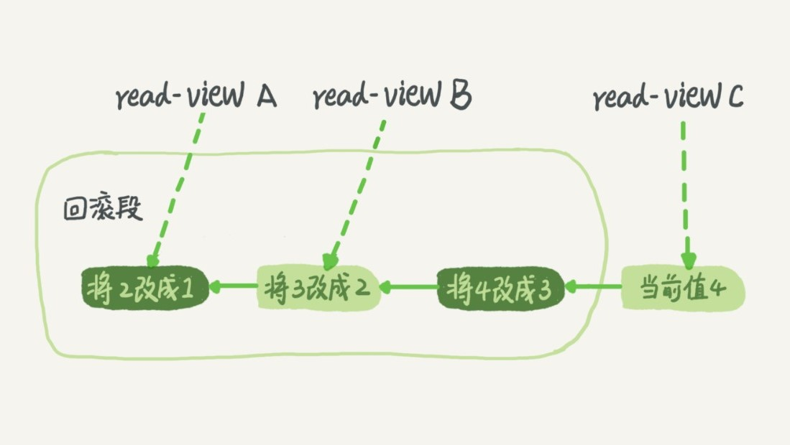
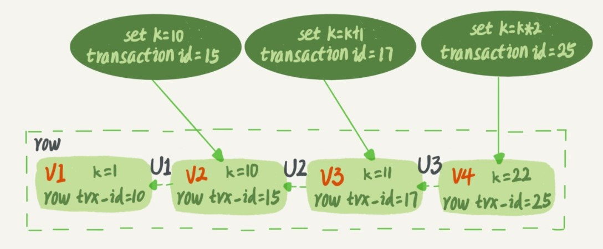
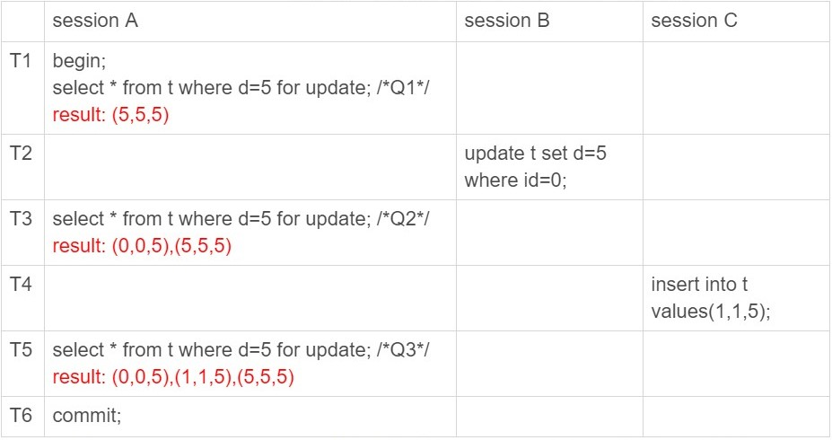

# MySQL 事务

> 事务就是通过数据库的

## 1.事务简介

> 应用程序可以借助数据库提供的**原子性和隔离性**, 以达到**一致性**.
>
> A: 原子性(Atomic), 事务作为一个整体被执行, 要么全部成功, 要么全部失败(出错时终止事务并回退).
>
> C: 一致性(Consistent), 事务执行前后, 数据库中的数据应满足状态约束, 一般依靠应用程序来保证.
>
> I: 隔离性(Isolation), 同时运行的事务互不干扰, 严格的隔离性就是串行化, 实际使用不多, 而是使用相对实用的**弱隔离**.
>
> D: 持久性(Duration), 已被提交的事务对数据库的修改应永久保存在数据库中.

## 2.隔离性 Isolation

### 1.隔离性不同引发的问题

- **脏读**: 读到其他事务未提交的数据;
- **不可重读**: 在同一个事务中, 使用相同的查询语句, 同一资源前后读取值不一致;
- **幻读**: 同一个事务中多次读取一个范围内的记录, 数量不一致(读取到的结果集不一样, 不可重读是单一资源值不一致, 幻读是因为插入或删除数据导致结果集不一致).
- **丢失更新**: 两个事务同时修改资源, 导致其中一个的更新被覆盖.

### 2.隔离级别

> 具体到不同的数据库, 隔离级别的实现方式不同, 产生的问题也不相同;

- **`READ-UNCOMMITTED` 读未提交**

  - 可以读到其他事务为提交的数据. 也称为**脏读**.
  - 数据库的并发性最好, 但是数据的准确性最低.

- **`READ-COMMITTED` 读提交**
    - 只能读到已提交的数据, 写只会覆盖已成功提交的数据.
    - 只需要保存两个版本快照(已提交的旧版本, 未提交的新版本)
- 同一事务的多次读取结果可能不同(其他事务提交了修改), 称为**不可重复读问题**.
  
- **`REPEATABLE-READ` 可重复读**
    - MySQL 的默认事务隔离级别.
    - **同一个事务中多次读取相同的数据返回的结果是一样的**.
    - 通过MVVC和间隙锁解决幻读问题;
    - **更新丢失**: 事务内读取值并根据业务逻辑修改, 可能导致上次事务修改丢失.(账号余额计算, 递增计数等场景)
        - MySQL`update`语句先读后写, **读是读当前(普通`select`是读快照)**, 然后写, 并且加锁. 防止更新丢失.
        - 对于逻辑复杂的操作, 可以使用`select xxx for update;`或者`select xxx lock in share mode;`来读当前值.
    - **写倾斜**: 

- **`SERIALIZABLE` 串行化**
    - 如果有事务未提交, 则对其相关表的修改阻塞.
    - 如果有事务修改未提交, 则对其相关表的读取阻塞.

### 3.隔离的实现 MVCC

> **MVCC(Multi-Version Concurrent Control) 多版本并发控制**:  
>
> **可重复读**级别: 视图在事务启动时创建.
>
> **读提交**级别: 视图时在每个SQL语句开始执行的时候创建.
>
> 读未提交: 直接返回记录最新值. 串行化: 直接加锁, 避免并行访问.

- `read-view`: 不同时刻启动的事务会有不同的`read-view`.  事物内部只能看到当前`read-view`的值. 
    - 决定了事务执行期间**能看到什么数据**.
    - `read-view`可以通过`undo log`来实现.
- 回滚日志(`undo log`): 记录着回滚到某个时刻需要执行的操作. **通过回滚日志, 可以得到前一个状态的值.**
    - 对记录做了变更操作时, 就会产生`undo log`.
    - 通过回滚日志和当前值, 就可以计算出老的`read-view`的状态, 就相当于每个时刻, 数据库都有一个"快照".
    - 当系统中已经没有比某个回滚日志更早的`read-view`时, 回滚日志会被时时删除.
- 每个事务, 会有一个唯一的事务ID`transaction id`. 由小到大分配.
    - 
    - 更新数据时, 会生成一个新的数据版本, 对应一个`row trx_id`, 就是对应的事务id.
    - `V1, V2, V3`每次使用时需要根据最新版本和`undo log`计算出来.
- **"快照(snapshot)"**
    - 通过数据版本的`row trx_id`和当前事务id大小就可以确定当前事务可以看到的信息(只能读取当前事务之前的数据).
    - 大于当前事务id的版本信息都是不可见的, 就像在事务开启时, 对数据库做了"快照", 事务只能读取到那一时刻的信息.
    - 特殊: 事务启动时, 还要记录当前正在执行的事务列表(未提交的事务). 对于这部分更新产生的版本, 事务也是不可见的.
- **读当前和读快照**:
    - 普通`select`读快照.
    - 如果`select`加锁: `select ... lock in share mode;`或者`select ... for update;`则是读当前.
    - `update`语句: 先读后写, 也是读当前.并且会加记录锁. 其他事务中的`update`语句阻塞.
- 对于可重复读: 查询只承认**在事务启动前就已经提交完成的数据**.
- 对于读提交: 查询只承认**在语句启动前就已经提交完成的数据**.

### 4.MySQL隔离级别的配置

- 查看: `show variables like 'transaction_isolation';`
- 配置: `set [global] transaction_isolation ='read-committed/repeatable-read';`

## 3.锁

> 参考: 极客时间 <<MySQL实战45讲>> 6, 7, 20, 21,30小节.
>
> 加锁规则(可重读级别):
>
> 原则1: 加锁的基本单位是`next-key lock`, 前开后闭`( ]`一个区间.
>
> 原则2: 查找过程中访问到的**对象**才会加锁(**覆盖索引, 只会在索引上加锁. 不会对主键加锁**).
>
> 原则3: 无索引时, 会升级未表锁.
>
> 优化1: 索引上的等值查询，给唯一索引加锁的时候，next-key lock 退化为行锁(当前行存在时退化为行锁, 不存在就是间隙锁).
>
> 优化2: 索引上的等值查询，**向右遍历时且最后一个值不满足等值条件的时候，next-key lock 退化为间隙锁**。
>
> 一个bug: 唯一索引上的范围查询会访问到不满足条件的第一个值为止.

### 1.全局锁

- 对整个数据加锁.
- `FTWRL`全表只读: `FLUSH TABLE WITH READ LOCK;`
- 解锁: `UNLOCK TABLES;`客户端断开时自动释放.
- 典型使用场景: **做全库逻辑备份**;

### 2.表级锁

> 表级锁分为: 表锁, 元数据锁.

- 表锁:
    - 加锁: `lock tables tbl_name read/write;`
    - 释放: `unlock tables;`, 或者连接断开.
- 元数据锁(自动加锁, 不需要主动处理):
    -  访问表时, 会自动加锁`MDL`读锁, 阻止对表结构修改.
    - 当要对表结构变更时, 加`MDL`写锁.
- 注意: **如果加了读锁. 即使是当前线程, 也不允许写入;**

### 3.行锁

> 行锁是在引擎层实现. InnoDB 支持行锁

- **两阶段锁协议**: 在`InnoDB`中, **行锁是在需要的时候才加, 但是要在事务结束时才释放**.
    - 将最可能引起冲突, 影响并发的锁向后放.

- `update`语句会自动加行锁.
    - 锁加在索引上.
    - 如果`update`语句没有走索引, `InnoDB`内部会根据主键逐行扫描加锁, 事物提交时同一释放.
- 主动加锁:
    - 读锁: `select xxx lock in share mode;`
    - 写锁: `select xxx for update;`

### 4.死锁和死锁检测

- 死锁的查看:
    - 执行`show engine innodb status;` `LATESTDETECTED DEADLOCK`.

- 出现死锁的解决策略:
    - 设置超时: 通过`innodb_lock_wait_timeout`设置锁等待超时.
    - 开启死锁检测, 通过`innodb_deadlock_detect`开启.
        - 检测到死锁, 会主动回滚死锁链条中的某个事务.
        - 死锁检测需要消耗大量`CPU`资源.(可以通过限制并发量来减少`CPU`消耗)
    - 通过限制控制并发量, 也可以减少死锁的产生.

### 5.幻读和间隙锁

> 一个事务在**前后两次查询同一范围的时候, 后一次查询到了前一次查询没有看到的行(数量不一致, 或者多/少某一行数据**.
>
> 间隙锁可以随着数据范围的变动而变动

- 在假设场景下(id, c, d):
    - 
    - 在上述假设场景中, `Q1, Q2, Q3`查询, 查到的行数不同, 称为"幻读".
    - 在可重读级别下, 普通查询是读快照, 不会看到其他事务插入的数据,  幻读只有在**读当前**的情况下才会出现(加锁读, 或者更新).
- `InnoDB`的解决方案: 间隙锁(Gap Lock)
    - **某条记录**以及**这条记录前面间隙**上的锁.
    - 间隙锁, 锁的是两个值的空隙.
    - 间隙锁和行锁合称为: `next-key lock`, 每个`next-key lock`都是前开后闭的区间.

### 6.其他的锁的概念

- 意向锁:

    > 为了方便对表加锁时的判定, (对表加锁时, 需要判定是否存在行级锁)

    - 意向共享锁(IS): 事务**打算给数据行加行共享锁**; 给数据行加共享锁前必须先获取该表达的 IS 锁.
    - 意向排他锁(IX): 事务**打算给数据行加行排他锁**; 给数据行加排他锁前必须先取得该表的 IX 锁.

- **乐观锁和悲观锁**

    - 并不是具体的锁类型, 而是一种加锁的思想.
    - 一般的并发事务管理, 仅需要设置好适合的隔离级别, 就能解决大多的并发问题, 仅使用正常的 SQL 即可.
    - 对于当前隔离级别无法解决的问题,(例如 RR 级别的更新丢失). 需要额外手段.
    - **悲观锁**:
        - 每次拿数据都假设别人会来修改数据, 所以每次拿数据都会加锁. 来避免冲突.
        - 依靠数据库锁机制.
    - **乐观锁**:
        - 认为拿数据的时候别人不会修改, 所以不会上锁, 但是更新的时候会判定版本号来决定是否修改成功.
        - 例如:`UPDATE product SET stock=new_stock WHERE id=x and stock=old_stock;`,

## 4.持久化和WAL

> MySQL的持久化方案:
>
> 1. 内存中(`buffer pool`)的数据被修改后, 称为**脏页**, 脏页按照某种策略落盘(flush), 这时候, 内存和磁盘一致, 称为**干净页**.
>
> 2. MySQL依靠`redo log`和`binlog`保证异常崩溃时, 内存中未落盘的数据的不会丢失.
>
> **WAL**: Write-Ahead Log 先写日志. 将数据变更写入到持久存储之前, 预先写入到一个log中, log日志是追加形式, 效率相对较高, 增加了数据的写入效率.

### 1.Buffer Pool 和 Change Buffer

- `Buffer Pool`: 把磁盘数据加载到缓冲池, 避免每次访问都进行磁盘IO.
- `Change Buffer`: 非唯一普通索引页, 如果修改页不在**Buffer Pool**内, 写操作时, 并不会立刻将磁盘页加载到缓冲池, 而仅仅记录到Change Buffer), 等数据被读取时, 再merge到Buffer Pool中.
- **脏页的刷新**:
    - `redo log`写满时
    - 内存不足时.
    - 空闲时间.
    - 正常关闭前.

### 2.redo log 重做日志

> InnoDB 引擎特有的日志. 实现`crash-safe`能力(异常终止时, 可以通过`redo log`恢复. 在磁盘上表现为`ib_logfile[number]`文件的形式.
>
> 用于恢复异程序异常终止时, 内存中未落盘的**脏页**.

- `redo log`磁盘空间大小固定(配置指定文件数量和文件大小). 
    - `check_point`: 需要擦除位置, 之前的数据页已经刷新到磁盘.
    - `write pos`: 当前写记录的位置.
- 记录的是**数据页的物理修改**, 也就是**某个页产生了什么修改**. 相当于记录了要对磁盘进行什么样操作, **但不是数据页的完整数据**. 所以, `redo log`没有能力独自更新磁盘数据. 而是要依赖原有数据.
- 具有`prepare`和`commit`: 两阶段提交. 恢复时和`binlog`配合, 确定是否提交完成.
- 磁盘写入机制:
    - 有三个层级: `redo log buffer`, `FS page cache`, `硬盘`
    - 事务执行过程中, 写`redo log buffer`.
    - 事务完成时按照`innodb_flush_log_at_trx_commit`配置策略: 0:事务提交不写磁盘, 1:持久化到磁盘, 2.只写磁盘,不`fsync`.
    - 后台进程, 每隔1秒, 就会将`redo log buffer`写入磁盘, 并`fsync`
- 配置:
    - `innodb_log_buffer_size`: 文件大小.
    - `nnodb_log_files_in_group`:  Redo log文件数量.(按序号循环覆盖写入)
    - `innodb_log_group_home_dir`: 文件路径.
    - `innodb_flush_log_at_trx_commit=1`: 每次事务完成执行`flush`, 保证落盘. 

### 3.binlog

> `Server`层日志. 记录所有的逻辑操作(DDL, DML). 所有引擎都可使用. 只用于**归档**.
>
> 1. 保证非`InnoDB`引擎的工作.
> 2. 用于归档(追加写)

- `binlog`模式:
    - `statement`: 记录`sql`语句.该格式可能会造成主备不一致.
    - `row`: 记录行的内容, 记两套(更新前, 更新后). 空间占用较大.
    - `mixed`: MySQl 会判断这个`SQL`语句是否可能引起主备不一致.如果可能, 就用`row`格式.否则就用`statement`格式. 
    - 可以通过`binlog_format=mix/row/statement`配置.
- `binlog`完整性:
    - 为确保数据的正确归档, `binlog`通过格式保证完整性.
    - `statement`格式的, 最后会有`COMMIT`; 
    - `row`格式的, 最后会有`XID event`. 
    - `binlog_checksum=CRC32`: 校验和
- 磁盘写入机制:
    - 事务执行过程中, 先把日志写入`binlog cache`, 事务提交, 再把`binlog cache`写入文件.
    - 参数`sync_binlog`控制刷盘时机: 0, 受系统控制, 1.n, n次事务提交后强制刷盘.

- `mysqlbinlog`工具, 可以查看`binlog`中的内容.

### 4.两阶段提交和异常时的处理

> `redo log`是为了做`crash-safe`, `binlog`主要是做数据备份.
>
> 为了和`binlog`不发生冲突, `redo log`采用两阶段提交的策略.

- `redo log`和`binlog`有一个共同的数据字段, `XID`, 完成两者的相互关联.
- A时刻崩溃: 事务回滚. 
- B时刻崩溃:
    - 如果`redo log`事务完整, 也就是有了`commit`标识, 直接提交.
    - 如果`redo log`只有`prepare`. 则判断`binlog`是否完整(`binlog`有特殊格式保证完整性)
        - `binlog`完整: 提交事务.
        - `binlog`不完整, 回滚事务.
- 双"1"配置:
    - `sync_binlog=1`: `binlog`刷盘时机.
    - `innodb_flush_log_at_trx_commit=1`: `redo log`刷盘时机.****

### 5.持久化的整体流程

- 先查找数据, 如果在磁盘, 从磁盘读入内存.
- 更新数据. 调用引擎接口写入.

- `InnoDB`会先将数据更新到内存(`Buffer Pool`或者`Change Buffer`) 并将磁盘页更改写入到`redo log`, `redo log`处于`prepare`状态.  告知执行器(`Server`层), 可以提交事务.
    - 执行器生成`binlog`, 并将`binlog`写入磁盘.
    - 执行器调用事务提交接口, 将引擎`redo log`状态改为`commit`. 完成更新. 
    - 内存中数据被修改后, 称为脏页, 最终需要落盘. 可以和`redo log`无关联.
    - 崩溃恢复场景中, `InnoDB`根据`redo log`和`binlog`判断到数据丢失, 就会将其读到内存, 然后将`redo log`更新内存中的内容. 成为脏页, 最后落盘. 

## 5.事务相关的 SQL 语句

- `autocommit`: 自动提交模式, 每条 SQL 语句, 都是一个事务. 
    - 推荐设置为`1`, 有需要的地方显式开启事务.
    - 可以通过`SHOW VARIABLES LIKE 'autocommit'`查看当前设置.
    - 关闭自动提交后, 提交数据需要执行`COMMIT`;
- 显式的事务控制:

  - `START TRANSACTION / BEGIN`: 开始一个事务
  - `ROLLBACK;` 回退事务;
  - `COMMIT`: 提交;
  - `SAVEPOINT IDENTIFIER`: 保存点
  - `ROLLBACK TO []`: 回滚到保存点
- 隔离级别
  - 通过`SHOW VARIABLES LIKE "transaction_isolation";`查看事务隔离级别.
  - `SET transaction_isolation="REPEATABLE-READ"`: 修改隔离级别.
- 查询长事务:
    - `select * from information_schema.innodb_trx where TIME_TO_SEC(timediff(now(),trx_started))>60;` 查找持续时间超过60S的事务.

