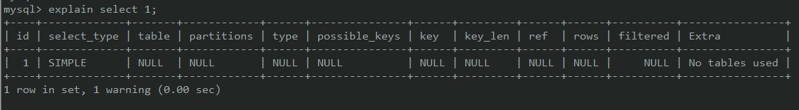
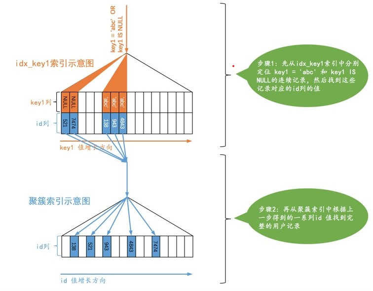
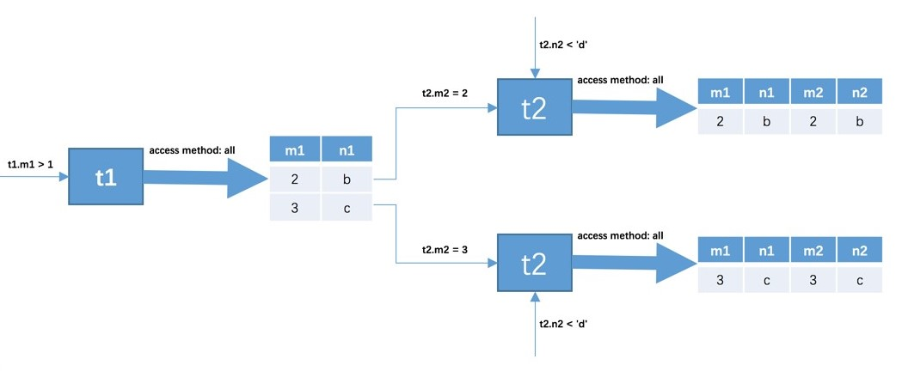
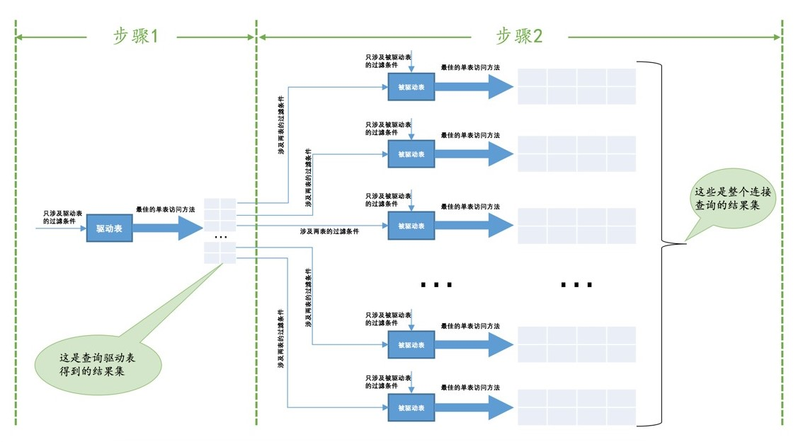

# MySQL 调优

## 1.EXPLAIN [参考](https://www.cnblogs.com/xuanzhi201111/p/4175635.html)

> 查询语句经过优化器后, 会生成一个执行计划. 通过`EXPLAIN`可以查看某个查询语句的`执行计划`.



- `EXPLAIN`出来的信息有 10 列，分别是:
  - `id`: `SELECT` 查询的标识符. 每个 SELECT 都会自动分配一个唯一的标识符.
  - `select_type`: SELECT 查询的类型.
- `table` : 查询的是哪个表;
- `partitions` : 匹配的分区
- `type` : **比较重要, 表明对表的访问方法**(access method):
  - `ALL`：遍历全表以找到匹配的行, 用不到索引, 其他类型都能使用索引.
  - `const`: 主键或者唯一索引等值匹配时.
  - `eq_ref`: 类似 ref，区别就在使用的索引是唯一索引，对于每个索引键值，表中只有一条记录匹配，简单来说，就是多表连接中使用 primary key 或者 unique key 作为关联条件
  - `ref`: 表示上述表的连接匹配条件，即哪些列或常量被用于查找索引列上的值
  - `range`: 使用索引获取某些**范围区间**记录.
  - `index`: 可以使用覆盖索引.
- `possible_keys`: **此次查询中可能选用的索引**;
- `key` : **实际查询中确切使用到的索引**.
- `key_len`: 索引长度, 精度满足, 越短越好
- `ref` : 哪些列或常量被用于查找索引列上的值
- `rows` : **估算的找到所需的记录所需要读取的行数**
- `filtered` : 表示此查询条件所过滤的数据的百分比
- `Extra`: 额外的信息

  - `Using filesort`: 需要额外的步骤来对返回行排序, 需要优化;
  - `Using temporary`: 使用了临时表, 需要优化;
  - `Select tables optimized away`: 通过索引一次性定位到数据行完成整个查询;

## 2.内部执行原理

### 1.count

- 聚合函数, 逐行判断, 如果count参数不是`NULL`, 累计值加1.
    - `count(*), count(1), count(id)`都是计算行数.
    - `count(字段)`: 计算字段不为`NULL`的行数
- 因为要判断字段是否为`NULL`, 所以, 不同`count`性能存在差异. 
- 效率比较:`count(字段)<count(主键)<count(1)==count(*)`

### 2.排序

- MySQL会给每个线程分配一块内存用于排序, 称为`sort_buffer`.

### 3.如何使用join

- 应该使用小表最为驱动表.
    - 表的大小是各自按照查询的过滤条件, 筛选后的大小.
- 分析语句, 如果被驱动表可以使用索引, 使用就没有问题. 如果`explain`结果显示`Block Nested Loop`字样, 扫描的行数过多, 会导致问题. 尽量不要使用.

### 4.主键的自增

- 参数:
    - `auto_increment_offset`: 控制自增初始值.
    - `auto_increment_increment`: 控制自增步长.
- 自增只保证递增, 不保证连续.

### 5.访问方法( access method )

```sql
CREATE TABLE single_table (
    id INT NOT NULL AUTO_INCREMENT,
    key1 VARCHAR(100),
    key2 INT,
    key3 VARCHAR(100),
    key_part1 VARCHAR(100),
    key_part2 VARCHAR(100),
    key_part3 VARCHAR(100),
    common_field VARCHAR(100),
    PRIMARY KEY (id),
    KEY idx_key1 (key1),
    UNIQUE KEY idx_key2 (key2),
    KEY idx_key3 (key3),
    KEY idx_key_part(key_part1, key_part2, key_part3)
) Engine=InnoDB CHARSET=utf8;
```

- 对于单表查询:
    - 全表扫描查询:
    - 使用索引:
        - 主键或者唯一索引的等值查询.
        - 针对普通二级索引的等值查询
        - 针对索引列的范围查询
        - 直接扫描整个索引
- **const**:
    - `SELECT * FROM single_table WHERE id = 1438;`
    - `SELECT * FROM single_table WHERE key2 = 3841;`
    - 主键或者唯一索引的等值查询.
- **ref**: 
    - `SELECT * FROM single_table WHERE key1 = 'abc';`
    - 普通索引的等值查询, 可能不唯一, 需要查询多次, 但是值是连续的(B+树结构).
- **ref_or_null**: 
    - `SELECT * FROM single_table WHERE key1 = 'abc' or key1 IS NULL;`
    - 普通索引的等值查询, 还包含值为`NULL`情况下的查询(`NULL`值在索引结构中的开头, 且也是连续的), 如果普通的值, 则不一样, 需要再经历一次查询.
    - 
- **range**: 
    - `SELECT * FROM single_table WHERE key2 IN (1438, 6328) OR (key2 >= 38 AND key2 <= 79);`
    - 需要多次查询, 但是可以利用二级索引, 多次查询后, 回表查数据.
- **index**: 
    - `SELECT key_part1, key_part2, key_part3 FROM single_table WHERE key_part2 = 'abc';`
    - **仅需要完整遍历索引结构, 不用回表**, 相对于全表遍历, 索引结构较小. 
- **all**:
    - 全表扫描.

### 6.连接查询

> 连接查询结果就是包含一个表中的每一条记录和另一个表中的每一条记录相互匹配的组合. **笛卡尔积**.

- `SELECT * FROM t1, t2 WHERE  t1.m1>1 AND t1.m1=t2.m2 AND t2.n2<'d';`连接过程:

    - 1. 首先确定第一个需要查询的表, 称为**驱动表**.

        2. 从驱动表查找出符合条件的记录`t1.m1>1`;

        3. 遍历驱动表产生的结果集中的每一条记录,  到另一张表中查询匹配的记录.

            

- 内连接和外连接:

    - **内连接**: 
        - 驱动表中的记录在被驱动表中找不到匹配记录的, 结果不会加入结果中.
        - 选取不同的驱动表会影响查询效率.
        - 被驱动表应尽量使用索引`Index Nested-Loop Join`(否则需要全表遍历多次`Simple Nested-Loop Join/Block Nested-Loop Join`, 尽量不要使用连接查询了.)
        - 
    - **外连接**: 左外: 选取左侧表作为驱动表. **驱动表固定**.
        - `WHERE`子句: 凡是不符合的都不会加入最后集合.
        - `ON`子句: 如果无法在被驱动表中找到匹配`ON`子句过滤条件的, 该记录仍然会被加入到结果集中.
    - `join buffer`:
        - 从驱动表中筛选出的数据, 每一条都要到被驱动表中查找一遍. **为减少被驱动表访问时的磁盘IO**, 设计出了`join buffer`.
        - 把若干条**驱动表结果记录在`join buffer`中, 然后扫描被驱动表, 每一条被驱动表记录一次性和`join buffer`中的多个驱动表记录匹配, 称为`Block Nested-Loop Join`
        - 可以通过`join_buffer_size`控制大小.
        - 

### 7.子查询

> 出现在查询语句的某个位置中的查询称为**子查询**.

- 子查询示例:
    - `SELECT (SELECT m1 FROM t1 LIMIT 1);`
    - `SELECT m, n FROM (SELECT m2+1 AS m, n2 AS n FROM t2 WHERE m2 > 2) AS t;`
        - 子查询的结果相当于一个名称为t的表. 称之为`派生表`.
    - `SELECT * FROM t1 WHERE m1 IN (SELECT m2 FROM t2);`
- 子查询可以返回不同的类型: 标量(单一值), 行, 列, 表.

## 3.慢查询日志

- 通过配置开启慢查询日志;
- 慢查询相关配置:

- `slow_query_log`: 是否开启, `ON/OFF`;

- `slow_query_log_file`: 日志路径;

- `log_queries_not_using_indexes`: 记录无索引查询, `ON/OFF`;

- `long_query_time`: 慢查询时间阈值;
- 通过`mysqldumpslow`工具, 分析慢查询日志, 找到具体需要优化的 sql 语句;
- 通过`EXPLAIN`语句, 分析具体执行计划, 优化 sql 语句;

## 4.使用及表结构上的优化

- 使用`EXPLAIN`查看如何执行 SELECT 语句;
- 存储过程比单条执行快速, 可以将常用操作转换为存储过程;
- 不检索不需要的数据;
- **子查询需要建立临时表, 效率低, 连接查询不需要建立临时表, 可以用连接查询替代子查询**;
- 表拆分: 当表数据量大时, 查询数据的速度会很慢; 对于某些字段使用频率很低的表, 可以进行拆分;
- 减少链表查询:
  - 增加中间表
  - 增加冗余字段


## 5.影响性能的一些配置参数

- `Buffer Pool`相关:
    - `innodb_buffer_pool_size`: `buffer_pool`缓冲池大小.
    - `innodb_old_blocks_pct`: `Old`部分占比.
    - `innodb_old_blocks_time`:停留窗口时间.
- `Change Buffer`相关:
    - `innodb_change_buffer_max_szie`: 占整个`Buffer Pool`的比例.
    - `innodb_change_buffering`:配置哪些写操作启用写缓冲.`all, none, inserts, deletes`
- 连接:
    - `max_connections`: 控制MySQL实例同时存在的连接数上限.
    - `interactive_timeout`: 关闭交互式连接等待秒数.
    - `wait_timeout`: 关闭非交互式连接等待秒数.
- `redo log`:
    - `innodb_log_buffer_size`: 文件大小.
    - `innodb_log_files_in_group`:  Redo log文件数量.(按序号循环覆盖写入)
    - `innodb_log_group_home_dir`: 文件路径.
    - `innodb_flush_log_at_trx_commit=1`: 每次事务完成执行`flush`, 保证落盘. 
- `binlog`:
    - `sync_binlog`: binlog刷盘时机.
    - `binlog_cache_size`: binlog 缓存大小.
- `锁`:
    - `lock_wait_timeout`: 超时等待时间.
    - `innodb_lock_wait_timeout`: innodb锁超时.
    -  `innodb_deadlock_detect`: 死锁检测

- 排序:
    - `sort_buffer_size`: 排序缓存大小. 