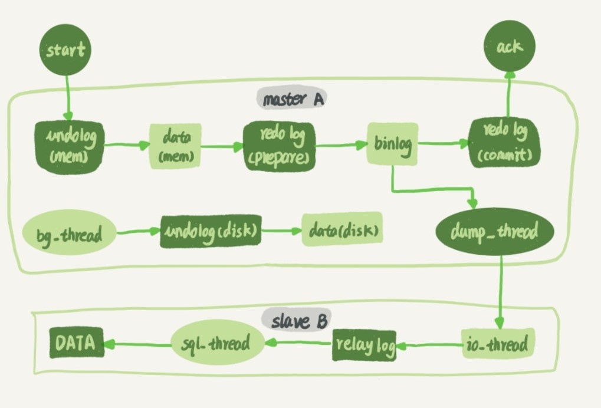
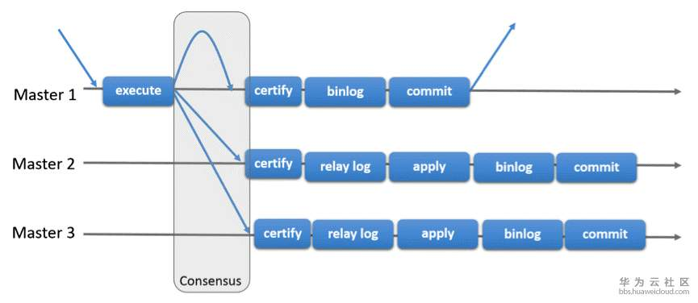

## 1.MySQL 集群简介

- MGR: MySQL Group Replication, MySQL 官方于 2016 年 12 月推出的一个全新的高可用于高扩展解决方案, 5.7 以上版本支持;
- PXC
- MHA: Master High Availability, 一个 MySQL 高可用性环境下故障切换和主从提升的高可用软件, MHA 只负责 MySQL 主库的高可用. 主库故障时, MHA 会选择一个候选主节点作为新的主节点.

## 2.主从同步



- 主从备份步骤:
    - 1.备库B上通过`change master`命令, 设置主库A的IP, 端口, 用户名,密码,以及需要从哪个位置开始请求`binlog`, 这个位置包含文件名和日志偏移量.
    - 2.在备库B上执行`start slave`命令, 备库会启动两个线程, `io_thread`和`sql_thread`
    - 3.主库校验用户和密码, 开始按照备库B要求的位置, 从本地读取`binlog`, 发送给B.
    - 4.备库拿到`binlog`后, `io_thread`负责写到本地文件`relay log`, `sql_thread`读取中转日志, 解析出日志里的命令, 并执行. 

## 3.高可用

> 主备延迟: 同一事物, 备库执行完成的时间和主库执行完成的时间之间的差值. 可以在备库上执行`show slave status;` 返回结果会显示`seconds_behind_master`

### 1.可靠性优先策略

- 主备切换, **由专门的HA系统来完成**:
    - 1.判断备库B的`seconds_behind_master`, 如果小于某个值(比如5), 继续下一步, 否则持续重试.
    - 2.把主库A改为只读.
    - 3.判断B的`seconds_behind_master`, 直到变为0.
    - 4.把B改为可读状态.
    - 5.把业务请求切到B.

### 2.可用性有限策略

- 直接将备机设置为可读, 把业务请求切换到备机.
- 切换过程可能出现数据不一致.

### 3.健康情况的判定

- 并发连接和并发查询: 
    - `innodb_thread_concurrency`: 用于控制InnoDB的并发线程上限.`0`表示只允许3ge线程并行执行.
    - 并发连接: 连接数量可以很大, 仅占用更多的内存, 通过`show processlist;`可以查看连接;
    - 并发查询: 线程并行执行查询.
- `select 1;`: 相当于仅判断连接性.
- `update 

## 2.MGR

> 参考: [MySQL 集群 MGR 架构](<[https://www.93bok.com/MySQL%E9%9B%86%E7%BE%A4MGR%E6%9E%B6%E6%9E%84for%E5%8D%95%E4%B8%BB%E6%A8%A1%E5%BC%8F/](https://www.93bok.com/MySQL集群MGR架构for单主模式/)>), [MySQL 组复制](https://dev.mysql.com/doc/refman/5.7/en/group-replication.html), [MySQL Group Replication 解析](https://bbs.huaweicloud.com/blogs/115356)

### 1.概述

#### 1.组复制

> 组复制是一个通过消息传递相互交互的 server 集群, 通信层提供了原子消息和完全有序信息交互等保障机制

- 复制组由多个`server`成员构成, 对所有 RW 事务只有在冲突检测成功后才提交, RO 事务不需要冲突检测;

- 组复制是一种`share-nothing`的复制方案, 其中每个 server 成员都有自己的完整数据副本;

  - `share nothing`: 不存在资源共享, 各处理单元通过协议通信;
  - `share disk`: 各处理单元具有私有的 CPU, Memory, 共享磁盘系统;
  - `share everthing`: 共享磁盘和内存中的数据;

- 组成员间需对事务达成一致意见, 还需要对组成员更新达成一致意见;

- 协商通过`Paxos`算法实现, 保证数据库集群节点数据强一致;

  

#### 2.模式

- 单主模式: 只有主节点可读写, 组中其他成员被自动设置为只读模式;
  - 如果主服务器从组中移除, 将按照顺序从组成员中选择主节点;
- 多主模式: 成员间无差异, 均可读可写;

#### 3.Paxos 算法

> 一种基于消息传递且具有高度容错特性的**一致性算法**
>
> 参考: [知乎](https://www.zhihu.com/question/19787937), [wiki](<[https://zh.wikipedia.org/wiki/Paxos%E7%AE%97%E6%B3%95](https://zh.wikipedia.org/wiki/Paxos算法)>)

- 通过 Paxos 算法, 使每个参与者达成一致意见;

### 2.操作

- 配置文件:

  ```ini
  [mysqld]
  # Group Replication 相关配置

  server_id = 1                       # server id
  gtid_mode=ON                        # 全局事务
  enforce_gtid_consistency=ON         # 强制GTID一致
  master_info_repository=TABLE        # master.info元数据保存在表中
  relay_log_info_repository=TABLE     # relay.info元数据保存在表中
  binlog_checksum=NONE                # 禁用二进制日志事件校验
  log_slave_updates=ON                # 级联复制
  log_bin=binlog                      # 二进制日志
  binlog_format=ROW                   # 二进制日志格式

  transaction_write_set_extraction=XXHASH64
  loose-group_replication_group_name="aaaaaaaa-aaaa-aaaa-aaaa-aaaaaaaaaaaa" # 组名
  loose-group_replication_start_on_boot=OFF                                 # server启动时, 不自动启动组复制
  loose-group_replication_local_address= "192.168.56.101:33061"             # 本机的组传入连接
  loose-group_replication_group_seeds= "192.168.56.101:33061,192.168.56.102:33061,192.168.56.103:33061"          # 组成员
  loose-group_replication_bootstrap_group=OFF                               # 不启用引导组
  ```

- 在所有节点上安装 MGR 插件并创建并设置复制帐号

  ```sql
  # 安装MGR插件
  mysql>INSTALL PLUGIN group_replication SONAME 'group_replication.so';

  # 设置复制账号
  mysql> SET SQL_LOG_BIN=0;
  mysql> CREATE USER repl@'%' IDENTIFIED BY 'repl';
  mysql> GRANT REPLICATION SLAVE ON *.* TO repl@'%';
  mysql> FLUSH PRIVILEGES;
  mysql> SET SQL_LOG_BIN=1;

  mysql> CHANGE MASTER TO MASTER_USER='repl', MASTER_PASSWORD='repl' FOR CHANNEL 'group_replication_recovery';
  ```

## 3.PXC

## 4.MHA

> 相对成熟的 MySQL 集群方案, MHA 完成主切换后, 通过 VIP 漂移或 zk 注册, 完成主节点切换;
>
> 参考: [美团数据库高可用架构演进与设想](https://tech.meituan.com/2017/06/29/database-availability-architecture.html), [wiki](https://github.com/yoshinorim/mha4mysql-manager/wiki/Overview), [MySQL 高可用架构之 MHA](https://www.cnblogs.com/gomysql/p/3675429.html)

## 5.集群相关底层技术

### 1.Binlog

> 记录所有的`DDL`和`DML`语句(除了查询 select, show 等)
>
> 使用场景: MySQL 主从复制, 数据恢复;

- 开启二进制日志

  ```ini
  [mysqld]
  log-bin=binlogname                    # 会开启二进制日志并存储为 binlogname.00000x 文件
  ```

- 相关变量

  - `log_bin`: 是否开启二进制日志
  - `log_bin_basename`: 日志路径
  - `log_bin_index`: 索引路径
  - `binlog_format`: 日志格式

- 格式:

  - `ROW`: 记录修改的详细信息
  - `Statement`: 记录具体执行的 sql 语句;
  -

- 读取二进制文件:
