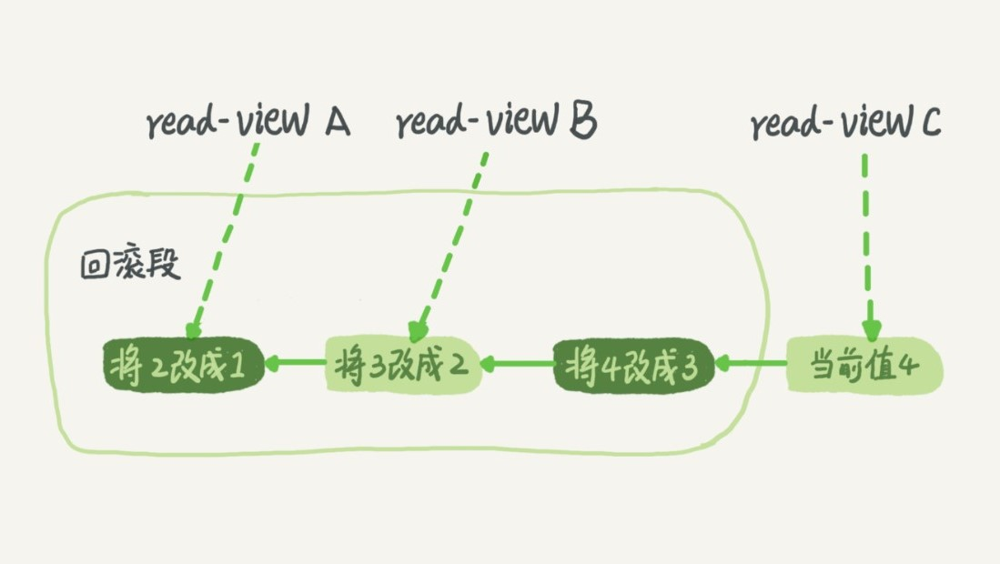
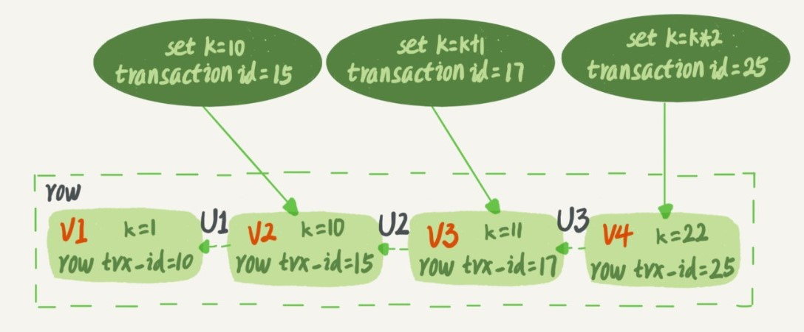
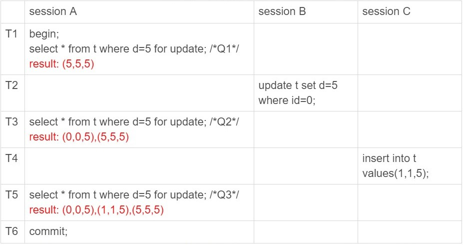

# MySQL 事务

> 简单来说, 事务就是要保证一组数据库操作, 要么成功, 要么失败

## 1.事务简介

> 数据库事务拥有四个特性, 称为 ACID:
>
> A: 原子性(Atomic), 事务作为一个整体被执行, 要么全部执行, 要么不执行.
>
> C: 一致性(Consistent), 事务执行前后, 数据库中的数据应满足完整性约束.
>
> I: 隔离性(Isolation), 多个事务并发执行, 一个事务不应该影响其他事务的执行.
>
> D: 持久性(Duration), 已被提交的事务对数据库的修改应永久保存在数据库中.

## 2.隔离性 Isolation

### 1.事务并发的问题

- **脏读**: 读到其他事务未提交的数据;
- **不可重读**: 在同一个事务中, 使用相同的查询语句, 同一资源前后读取值不一致;
- **幻读**: 同一个事务中多次读取一个范围内的记录, 数量不一致(读取到的结果集不一样, 不可重读是单一资源值不一致, 幻读是因为插入或删除数据导致结果集不一致).
- **丢失更新**: 两个事务同时修改资源, 导致其中一个的更新被覆盖.

### 2.隔离级别

> 具体到不同的数据库, 隔离级别的实现方式不同, 产生的问题也不相同;

- **`READ-UNCOMMITTED` 读未提交**

  - 可以读到其他事务为提交的数据. 也称为**脏读**.
  - 数据库的并发性最好, 但是数据的准确性最低.

- **`READ-COMMITTED` 读提交**
    - 一个事务提交后, 变更才会被其他事务看到.
    - 同一事务的多次读取结果可能不同(其他事务提交了修改), 称为**不可重复读问题**.

- **`REPEATABLE-READ` 可重复读**

  - MySQL 的默认事务隔离级别.
  - **同一个事务中多次读取相同的数据返回的结果是一样的**.
  - 通过MVVC和间隙锁解决幻读问题;

- **`SERIALIZABLE` 串行化**
    - 如果有事务未提交, 则对其相关表的修改阻塞.
    - 如果有事务修改未提交, 则对其相关表的读取阻塞.
    - 代价高, 性能低.

### 3.事务隔离的实现

> **MVCC(Multi-Version Concurrent Control) 多版本并发控制**:  
>
> **可重复读**级别: 视图在事务启动时创建.
>
> **读提交**级别: 视图时在每个SQL语句开始执行的时候创建.
>
> 读未提交: 直接返回记录最新值. 串行化: 直接加锁, 避免并行访问.

- `read-view`: 不同时刻启动的事务会有不同的`read-view`.  事物内部只能看到当前`read-view`的值. 
    - 决定了事务执行期间"能看到什么数据"
- 回滚日志(`undo log`): 记录着回滚到某个时刻需要执行的操作. 也就是通过回滚日志, 可以得到前一个状态的值.
    - 当系统中已经没有比某个回滚日志更早的`read-view`时, 回滚日志会被时时删除.
    - 通过回滚日志, 就可以计算出每一个`read-view`的状态, 就相当于每个时刻, 数据库都有一个"快照".
- 每个事务, 会有一个唯一的事务ID`transaction id`. 由小到大分配.
    - 
    - 更新数据时, 会生成一个新的数据版本, 对应一个`row trx_id`, 就是对应的事务id.
    - `V1, V2, V3`每次使用时需要根据最新版本和`undo log`计算出来.
- **"快照(snapshot)"**
    - 通过数据版本的`row trx_id`和当前事务id大小就可以确定当前事务可以看到的信息(只能读取当前事务之前的数据).
    - 大于当前事务id的版本信息都是不可见的, 就像在事务开启时, 对数据库做了"快照", 事务只能读取到那一时刻的信息.
    - 特殊: 事务启动时, 还要记录当前正在执行的事务列表(未提交的事务). 对于这部分更新产生的版本, 事务也是不可见的.
- **读当前和读快照**:
    - 普通`select`读快照.
    - 如果`select`加锁: `select ... lock in share mode;`或者`select ... for update;`则是读当前.
    - `update`语句: 先读后写, 也是读当前.并且会加记录锁. 其他事务中的`update`语句阻塞.
- 对于可重复读: 查询只承认**在事务启动前就已经提交完成的数据**.
- 对于读提交: 查询只承认**在语句启动前就已经提交完成的数据**.

### 4.MySQL隔离级别的配置

- 查看: `show variables like 'transaction_isolation';`
- 配置: `set [global] transaction_isolation ='read-committed/repeatable-read';`

## 3.锁

> 参考: 极客时间 <<MySQL实战45讲>> 6, 7, 20, 21,30小节.
>
> 加锁规则(可重读级别):
>
> 原则1: 加锁的基本单位是`next-key lock`, 前开后闭.
>
> 原则2: 查找过程中访问到的**对象**才会加锁(**覆盖索引, 只会在索引上加锁. 不会对主键加锁**).
>
> 优化1: 索引上的等值查询，给唯一索引加锁的时候，next-key lock 退化为行锁(当前行存在时退化为行锁, 不存在就是间隙锁).
>
> 优化2: 索引上的等值查询，向右遍历时且最后一个值不满足等值条件的时候，next-key lock 退化为间隙锁。
>
> 一个bug: 唯一索引上的范围查询会访问到不满足条件的第一个值为止.

### 1.全局锁

- 对整个数据加锁.
- `FTWRL`全表只读: `Flush tables with read lock;`
- 解锁: `UNLOCK TABLES;`
- 典型使用场景: **做全库逻辑备份**;

### 2.表级锁

- 表锁:
    - 加锁: `lock tables tbl_name read/write;`
    - 解锁: `unlock tables;`, 或者连接断开.
- 注意: **如果加了读锁. 即使是当前线程, 也不允许写入;**
    
- 元数据锁(`MDL`):
    -  不用显式调用, 当访问表时, 会自动加锁`MDL`读锁, 阻止对表结构修改.
    - 当要对表结构变更时, 加`MDL`写锁.

### 3.行锁

> 行锁是在引擎层实现. InnoDB 支持行锁.

- `update`语句会自动加行锁.
    - 锁加载索引上.
    - 如果`update`语句没有走索引, `InnoDB`内部会根据主键逐行扫描加锁, 事物提交时同一释放.

- **两阶段锁协议**: 在`InnoDB`中, **行锁是在需要的时候才加, 但是要在事务结束时才释放**.
    - 将最可能引起冲突, 影响并发的锁向后放.

### 4.死锁和死锁检测

- 死锁的查看:
    - 执行`show engine innodb status;` `LATESTDETECTED DEADLOCK`.

- 出现死锁的解决策略:
    - 设置超时: 通过`innodb_lock_wait_timeout`设置锁等待超时.
    - 开启死锁检测, 检测到死锁, 会主动回滚死锁链条中的某个事务, 通过`innodb_deadlock_detect`开启;
    - 死锁检测需要消耗大量`CPU`资源.(可以通过限制并发量来减少`CPU`消耗)
    - 通过限制控制并发量, 也可以减少死锁的产生.

### 5.幻读和间隙锁

> 一个事务在**前后两次查询同一范围的时候, 后一次查询到了前一次查询没有看到的行**.
>
> 间隙锁可以随着数据范围的变动而变动

- 在假设场景下(id, c, d):
    - 
    - 在上述假设场景中, `Q1, Q2, Q3`查询, 查到的行数不同, 称为"幻读".
    - 在可重读级别下, 普通查询是读快照, 不会看到其他事务插入的数据,  幻读只有在**读当前**的情况下才会出现(加锁读, 或者更新).
- `InnoDB`的解决方案: 间隙锁(Gap Lock)
    - 间隙锁, 锁的是两个值的空隙.
    - 间隙锁和行锁合称为: `next-key lock`, 每个`next-key lock`都是前开后闭的区间.
    - 

### 6.加锁的 SQL 语句汇总

- 库锁:
    - 加锁:`flush tables with read lock;`
    - 解锁: `unlock tables;`
- 表锁:
    - 加锁: `lock tables tbl_name read/write;`
    - 解锁: `unlock tables tbl_name;`
- 行锁:
    - 读锁: `select xx from tab_name where xxx lock in share mode;`
    - 写锁: `select xx from tab_name where xxx for update;`

## 4.事务相关的 SQL 语句

- `autocommit`: 自动提交模式, 每条 SQL 语句, 都是一个事务. 也可以通过`BEGIN/START TRANSACTION`显式开启一个事务.
- 推荐设置为`1`, 有需要的地方显式开启事务.
  - 可以通过`SHOW VARIABLES LIKE 'autocommit'`查看当前设置.
  - 关闭自动提交后, 提交数据需要执行`COMMIT`;
- 显式的事务控制:

  - `START TRANSACTION / BEGIN`: 开始一个事务
  - `ROLLBACK;` 回退事务;
  - `COMMIT`: 提交;
  - `SAVEPOINT IDENTIFIER`: 保存点
  - `ROLLBACK TO []`: 回滚到保存点
- 隔离级别
  - 通过`SHOW VARIABLES LIKE "transaction_isolation";`查看事务隔离级别.
  - `SET transaction_isolation="REPEATABLE-READ"`: 修改隔离级别.
- 查询长事务:
    - `select * from information_schema.innodb_trx where TIME_TO_SEC(timediff(now(),trx_started))>60;` 查找持续时间超过60S的事务.

#### 1.锁

> 通过锁的类型(S/X), 颗粒度, 持有锁的时间进行合理组合, 就可以实现不同的隔离级别.
>
> 当隔离级别无法解决当前的并发问题时, 也可以通过加锁的方式解决, 如RR级别下的丢失更新问题 .

- **表锁 VS 行锁**

    - 表锁: 
        - 由MySQL服务器实现.
        - 一般在执行`DDL`语句时, 如`ALTER TABLE`就会自动对整个表进行加锁.
        - 也可以明确的对某个表进行加锁: `LOCK TABLE xxx READ, LOCK TABLE xxx WRITE;`, 解锁: `UNLOCK TABLES;`
    - 行锁: 
        - 行锁是加在索引上的.
        - 常见的增删改(INSERT, DELETE, UPDATE)语句会自动对操作的数据行加写锁;
        - 显示加锁`SELECT ... LOCK IN SHARE MODE;`读锁, `SELECT ... FOR UPDATE;`写锁;

- **读锁 VS 写锁**

    - 共享锁: S 锁, 也称为读锁.
    - 排他锁: X 锁, 也称为写锁.

- 记录锁:

    - `UPDATE tb1 SET name='xx' WHERE id=5;`
    - 记录加在**索引上(使用的索引和聚簇索引)**.
    - 如果没有建立索引, MySQL 会进行全表扫描, 查询符合条件的数据, 这时, 会给**表的所有数据行加记录锁**.

- 间隙索引:

    - 在 RR 级别使用, RC 级别不会使用间隙锁.
    - 加在两个索引之间, 或者加在第一个索引之前/最后一个索引之后的间隙. 也称范围锁.
    - 防止其他事务在这个范围内插入或修改记录. 保证两次读取这个范围内的记录不变(解决幻读现象).

- Next-Key Locks(记录锁和间隙锁的组合):

    - 也是避免幻读, 使用在 RR 隔离级别上.
    - 主要产生在二级索引且非唯一的索引上, 避免因为插入相同索引值的行, 导致幻读.
    - 在**某条记录**以及**这条记录前面间隙**上的锁.
    - 所以需要将前一个索引值到当前索引值上加`Next-Key Locks`, 当前索引和下一个索引值间加间隙锁.

- 意向锁:

    > 为了方便对表加锁(对表加锁时, 需要判定是否和行级锁)

    - 意向共享锁(IS): 事务**打算给数据行加行共享锁**; 给数据行加共享锁前必须先获取该表达的 IS 锁.
    - 意向排他锁(IX): 事务**打算给数据行加行排他锁**; 给数据行加排他锁前必须先取得该表的 IX 锁.

- **乐观锁和悲观锁**

    - 并不是具体的锁类型, 而是一种加锁的思想.
    - 一般的并发事务管理, 仅需要设置好适合的隔离级别, 就能解决大多的并发问题, 仅使用正常的 SQL 即可.
    - 对于当前隔离级别无法解决的问题,(例如 RR 级别的更新丢失). 需要额外手段.
    - **悲观锁**:
        - 每次拿数据都假设别人会来修改数据, 所以每次拿数据都会加锁. 来避免冲突.
        - 依靠数据库锁机制.
    - **乐观锁**:
        - 认为拿数据的时候别人不会修改, 所以不会上锁, 但是更新的时候会判定版本号来决定是否修改成功.
        - 例如:`UPDATE product SET stock=new_stock WHERE id=x and stock=old_stock;`,
