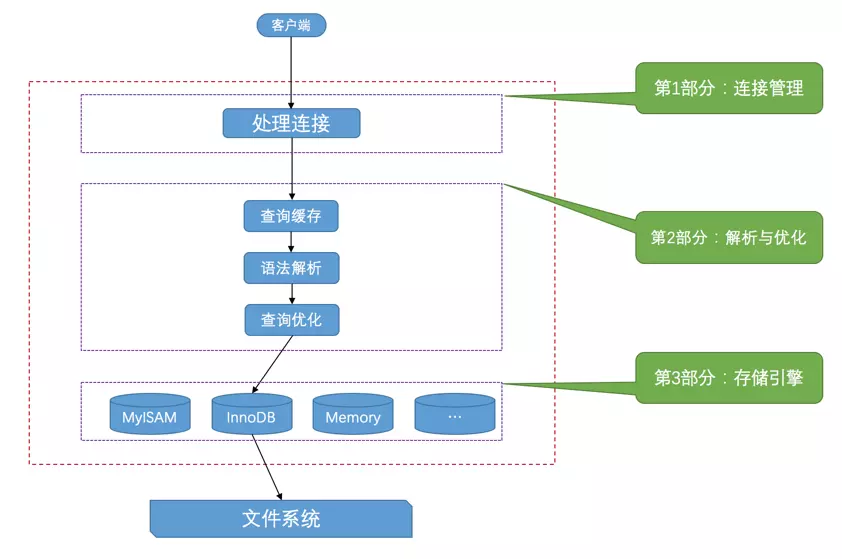

# MySQL基础架构

## 1.整体架构

- 客户端通过 TCP, UNIX 域套接字等方式连接到 MySQL 服务器, 客户端进程向服务端进程发送一段**文本(SQL 语句)**, 服务器进程处理后再向客户端进程发送一段文本(处理结果).

- 服务端处理可以分为三部分:
    - 连接管理: MySQL 服务器会为每一个连接进来的客户端分配一个线程;
    - sql 语句解析优化: 包括语法解析(编译), 查询优化(外连接转换为内连接、表达式简化、子查询转为连接);
    - 存储引擎: 对数据的存储和提取操作的封装;

## 2.连接器

- **MySQL 服务器会为每一个连接进来的客户端分配一个线程, 查询只会在这个单独的线程中执行.**
- 连接过程比较耗时, 客户端应尽量使用长连接或连接池. 
- 建立连接后(`socket`, `Unix socket`), 首先会进行权限验证.
    - 对密码进行摘要(**sha**), 然后对摘要加盐(服务端获取) 再次摘要(**sha**)
    - 将用户名和经过`hash`的密码发送服务端验证.
- MySQL在执行过程中临时使用的内存是管理在连接对象里, 这些资源会在连接断开或者是执行`mysql_reset_connection()`时释放.
    - 连接如果长时间未使用, 服务端会强制断开连接.
    - `interactive_timeout`: 交互式连接超时.
    - `wait_timeout`: 非交互式连接超时.
- 可以通过`show processlist`查询连接情况.

## 3.解析, 优化, 执行

- MySQL会解析查询, 并创建内部数据结构(解析树),  然后对其进行优化.
- 用户可以使用关键字提示(`hint`)优化器.
- 使用`explain`, 让优化器解释优化过程.

## 4.存储引擎

> 负责数据的存储和提取. 提供API, 服务器通过API与存储引擎通信.
>
> 除非用到了`InnoDB`不具备的特性, 并且没有其他办法可以替代, 否则, 都应该使用`InnoDB`.

- `InnoDB`: 
    - 默认的事务型引擎.
    - 采用`MVCC`来支持高并发, 并实现四个标准的隔离级别(默认是`REPEATABLE READ`.
    - 通过间隙锁`next-key locking`防止幻读.
- `MyISAM`: 占用空间小, 处理速度快, 但不支持事务完整性和并发;
    - 支持全文索引.
    - 频繁执行全表 count 的场景.
    - 适用于日志类型数据的存储.
- `Memory`: 存储于内存中, 默认使用哈希索引, 速度快.

## 5.数据库和文件系统

> 存储引擎会将数据写入磁盘(文件系统)中.

- **数据目录**是用来存储`MySQL`运行过程中产生的数据, 通过`datadir`指定.
- 数据库的表示:
    - 创建数据库时, 会在**数据目录**创建对应的子目录.
    - 在子目录创建`db.opt`的文件, 记录数据库的属性.
- 表的表示:
    - 表结构: `表名.frm`
    - 表数据: `表名.idb`
- `InnoDB`的表数据存储.
    - 以页为基本单位来管理存储空间, 默认大小是`16KB`.
    - 每个索引都对应一棵`B+`树. 该`B+`树的每个**节点**都是一个数据页.
    - **聚簇索引**的叶子节点存储了完整的用户记录.