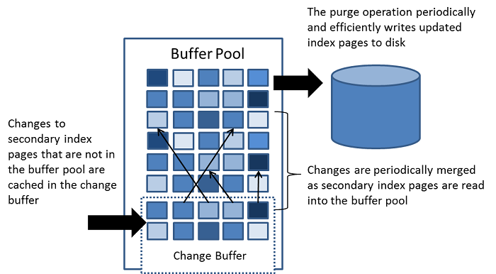
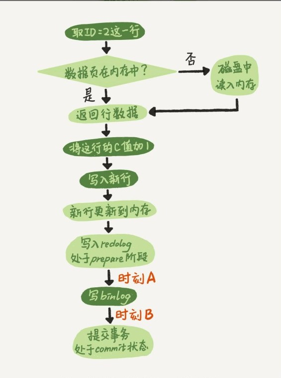

# MySQL基础架构

## 1.整体架构

> MySQL大致可以分为两层: `Server`层和存储引擎层.
>
> `Server`层涵盖`MySQL`的大多数核心服务功能. 跨引擎的功能都在这一层实现.
>
> 引擎层: 负责数据的存储和提取.

- 客户端通过 TCP, UNIX 域套接字等方式连接到 MySQL 服务器, 客户端进程向服务端进程发送一段**文本(SQL 语句)**, 服务器进程处理后再向客户端进程发送一段文本(处理结果).

## 2.连接器

- **MySQL 服务器会为每一个连接进来的客户端分配一个线程, 查询只会在这个单独的线程中执行.**
- 建立连接过程比较耗时, 客户端应尽量使用长连接或连接池. 
- 建立连接后(`socket`, `Unix socket`), 首先会进行权限验证: **账号验证和权限读取**.
    - 客户端: 对密码进行摘要(**sha**), 然后对摘要加盐(服务端获取) 再次摘要(**sha**), 将用户名和经过`hash`的密码发送服务端验证.
    - 建立连接后, 权限已确定, 如果权限修改, 只有等待重新连接后才会生效.
- MySQL在执行过程中临时使用的内存是管理在连接对象里, 这些资源会在连接断开或者是执行`mysql_reset_connection()`(初始化连接资源)时释放.
    - 连接如果长时间未使用, 服务端会强制断开连接.
    - `interactive_timeout`: 交互式连接超时.
    - `wait_timeout`: 非交互式连接超时.
- 可以通过`show processlist`查询连接情况.
- 执行器判断表的权限, 调用引擎接口.
- 配置:

    - `max_connections`: 控制MySQL实例同时存在的连接数上限.

## 3.解析, 优化, 执行

- MySQL会解析查询, 并创建内部数据结构(解析树),  然后对其进行优化.
    - **优化器负责选择索引.**
    - 优化器根据扫描行数的多少,  是否会使用临时表, 是否排序等因素进行判定, 选择合适的索引.
    - 扫描行数的多少的判定?
        - 一个索引上不同值越多. 这个索引的分区度就越好, 不同值的个数称为"基数 Cardinality"
        - 可以通过`show index from table_name;`查看.
- 用户可以使用关键字提示(`hint`)优化器.
- 使用`explain`, 让优化器解释优化过程.

## 4.存储引擎

> 负责数据的存储和提取. 提供API, 服务器通过API与存储引擎通信.
>
> 除非用到了`InnoDB`不具备的特性, 并且没有其他办法可以替代, 否则, 都应该使用`InnoDB`.

- `InnoDB`: 
    - 默认的事务型引擎.
    - 采用`MVCC`来支持高并发, 并实现四个标准的隔离级别(默认是`REPEATABLE READ`.
    - 通过间隙锁`next-key locking`防止幻读.
- `MyISAM`: 占用空间小, 处理速度快, 但不支持事务完整性和并发;
    - 支持全文索引.
    - 频繁执行全表 count 的场景.
    - 适用于日志类型数据的存储.
- `Memory`: 存储于内存中, 默认使用哈希索引, 速度快.

### 1.Buffer Pool

> 缓存表数据和索引数据, 把磁盘数据加载到缓冲池, 避免每次访问都进行磁盘IO

-  Buffer Pool 是由多个**页**面组成的一个链表. 通过`LRU`(最近最少使用)算法更新缓存.
-  缓存更新算法:
    -  `LRU`: 新访问的元素, 放到队头, 如果长度超出, 弹出队尾元素.
    -  `MySQL`的Buffer Pool: 队列分为`New Old`两部分.
        -  新页加入缓冲池时, 只加入`Old`头部, 如果数据真正被读取(预读成功), 才加入到`New`头部.
        -  如果页仅加入了队列, 但是并没有真正读取到数据, 会先被淘汰.
        -  `MySQL`缓冲池污染? 执行需要扫描大量数据时, 可能导致把缓冲池所有页都替换出去, 导致大量热数据被换出.
    -  停留窗口时间: 插入`Old`头部的页, 需要满足在`Old`部分停留超过一定时间, 才会被放入`New`部分. 
        -  **保证缓冲的数据是被持续访问的热数据, 而不是短时间内被访问的数据.**
-  `flush`链表: `Buffer Pool`中被修改的页组成的, 一定时机会同步到磁盘.
-  相关配置:
    -  `innodb_buffer_pool_size`: 缓冲池大小.
    -  `innodb_old_blocks_pct`: `Old`部分占比.
    -  `innodb_old_blocks_time`:停留窗口时间. ms.

### 2.Change Buffer

> 如果修改页不在**Buffer Pool**内, 优化磁盘效率的方式.
>
> 应用在**非唯一普通索引页**不在Buffer Pool中, 对页进行了写操作, 并不会立刻将磁盘页加载到缓冲池, 而仅仅记录缓冲变更(Change Buffer), 等数据被读取时, 再merge到Buffer Pool中.

- 写操作变成仅仅是内存操作. 不会触发磁盘读写(redo log还是会写)
- 有该数据的读取时, 会将数据合并到`Buffer Pool`.
- 内存中的数据, 会被定期刷盘.
- 为什么仅适用于**非唯一普通索引**? : 如果设置唯一属性, 修改时, 必须进行唯一性检查. 所以, 也就必须读取磁盘信息. 
- 适用场景:
    - 适应于写入后, 被访问的概率较小的业务厂家场景.
- 相关配置:
    - `innodb_change_buffer_max_szie`: 占整个`Buffer Pool`的比例.
    - `innodb_change_buffering`:配置那些写操作启用写缓冲.`all, none, inserts, deletes`

## 5.数据库和文件系统

> 存储引擎会将数据写入磁盘(文件系统)中.

- **数据目录**是用来存储`MySQL`运行过程中产生的数据, 通过`datadir`指定.
- 数据库的表示:
    - 创建数据库时, 会在**数据目录**创建对应的子目录.
    - 在子目录创建`db.opt`的文件, 记录数据库的属性.
- 表的表示:
    - 表结构: `表名.frm`
    - 表数据: `表名.idb`
- `InnoDB`的表数据存储.
    - 以页为基本单位来管理存储空间, 默认大小是`16KB`.
    - 每个索引都对应一棵`B+`树. 该`B+`树的每个**节点**都是一个数据页.
    - **聚簇索引**的叶子节点存储了完整的用户记录.

## 6.WAL Write-Ahead Log

> 执行更新语句的流程: 
>
> 1. 先查找数据, 如果在磁盘, 从磁盘读入内存.
> 2. 更新数据. 调用引擎接口写入.
> 3.  `InnoDB`会先将数据更新到内存(`Buffer Pool`或者`Change Buffer`) 并将磁盘页更改写入到`redo log`, `redo log`处于`prepare`状态.  告知执行器(`Server`层), 可以提交事务.
> 4. 执行器生成`binlog`, 并将`binlog`写入磁盘.
> 5. 执行器调用事务提交接口, 将引擎`redo log`状态改为`commit`. 完成更新. 
> 6. 内存中数据被修改后, 称为脏页, 最终需要落盘. 可以和`redo log`无关联.
> 7. 崩溃恢复场景中, `InnoDB`根据`redo log`和`binlog`判断到数据丢失, 就会将其读到内存, 然后将`redo log`更新内存中的内容. 成为脏页, 最后落盘. 
>
> WAL机制, 将数据写入转换为日志写入(顺序写), 避免了磁盘的数据查找和写入.

### 1.redo log 重做日志

> InnoDB 引擎特有的日志. 实现`crash-safe`能力(异常终止时, 可以通过`redo log`恢复.
>
> 在磁盘上表现为`ib_logfile[number]`文件的形式.

- `redo log`磁盘空间大小固定(配置指定文件数量和文件大小). 
    - `check_point`: 需要擦除位置, 擦除前, 要把记录更新到数据文件.
    -  `write pos`: 当前记录位置.
- 记录的是**数据页的物理修改**, 也就是**某个页产生了什么修改**. 相当于记录了要对磁盘进行什么样操作, **但不是数据页的完整数据**. 所以, `redo log`没有能力独自更新磁盘数据. 而是要依赖原有数据.
- `prepare`和`commit`: 两阶段提交.
- 磁盘写入机制:
    - 有三个层级: `redo log buffer`, `FS page cache`, `硬盘`
    - 事务执行过程中, 写`redo log buffer`.
    - 事务完成时按照`innodb_flush_log_at_trx_commit`配置策略: 0:事务提交不写磁盘, 1:持久化到磁盘, 2.只写磁盘,不`fsync`.
    - 后台进程, 每隔1秒, 就会将`redo log buffer`写入磁盘, 并`fsync`
- 配置:
    - `innodb_log_buffer_size`: 文件大小.
    - `nnodb_log_files_in_group`:  Redo log文件数量.(按序号循环覆盖写入)
    - `innodb_log_group_home_dir`: 文件路径.
    - `innodb_flush_log_at_trx_commit=1`: 每次事务完成执行`flush`, 保证落盘. 

### 2.binlog

> `Server`层日志. 记录所有的逻辑操作(DDL, DML). 所有引擎都可使用. 只用于**归档**.
>
> 1. 保证非`InnoDB`引擎的工作.
> 2. 用于归档(追加写)

- `binlog`模式:
    - `statement`: 记录`sql`语句.该格式可能会造成主备不一致.
    - `row`: 记录行的内容, 记两套(更新前, 更新后). 空间占用较大.
    - `mixed`: MySQl 会判断这个`SQL`语句是否可能引起主备不一致.如果可能, 就用`row`格式.否则就用`statement`格式. 
    - 可以通过`binlog_format=mix/row/statement`配置.
- `binlog`完整性:
    - 为确保数据的正确归档, `binlog`通过格式保证完整性.
    - `statement`格式的, 最后会有`COMMIT`; 
    - `row`格式的, 最后会有`XID event`. 
    - `binlog_checksum=CRC32`: 校验和
- 磁盘写入机制:
    - 事务执行过程中, 先把日志写入`binlog cache`, 事务提交, 再把`binlog cache`写入文件.
    - 参数`sync_binlog`控制刷盘时机: 0, 受系统控制, 1.n, n次事务提交后强制刷盘.

- `mysqlbinlog`工具, 可以查看`binlog`中的内容.

### 3.两阶段提交和异常时的处理

- `redo log`和`binlog`有一个共同的数据字段, `XID`, 完成两者的相互关联.
- A时刻崩溃: 事务回滚. 
- B时刻崩溃:
    - 如果`redo log`事务完整, 也就是有了`commit`标识, 直接提交.
    - 如果`redo log`只有`prepare`. 则判断`binlog`是否完整(`binlog`有特殊格式保证完整性)
        - `binlog`完整: 提交事务.
        - `binlog`不完整, 回滚事务.
- 双"1"配置:
    - `sync_binlog=1`: `binlog`刷盘时机.
    - `innodb_flush_log_at_trx_commit=1`: `redo log`刷盘时机.
