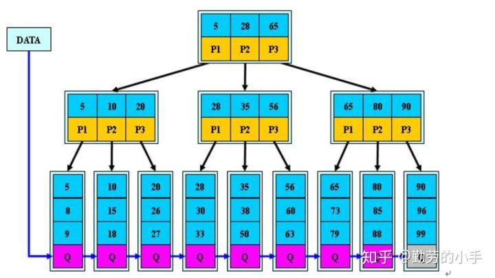

# MySQL 索引

> 基于原始数据派生的额外的数据结构, 提高数据查询的效率, 但降低了写入速度.

## 1.索引用到的数据结构

### 1.B树

- 又称为平衡多路查找树. 每个节点可以**有多个子树，M 阶 B 树表示该树每个节点最多有 M 个子树**
- 通过约束所有叶子节点深度来保持树的平衡.
- 利用局部性原理, 为提高磁盘效率, 应尽量使的数据存储的更为紧密, 每个节点存储更多的数据.(M阶)
    - 节点上数据增序排列.
    - 数据可以存储在叶子节点或者内部节点.

### 2.B+树

> 操作系统是按页(PAGE, 可以通过`getconfig PAGE_SIZE`查看)来读内存和磁盘中的数据.
>
> 如果数据分散在多页, 就会触发多次`IO`. 

- 内部节点只存索引, (**增大了非叶子节点保存关键字的能力**(存的更多)).
- 数据只存储在叶子节点上
- 叶子节点有序.
- 叶子节点之间串联在一起, 便于范围查找.
- 一般根结点会也会存储在内存中, 其他结点存储在磁盘中. 

- B+树的优点:
  - 内部节点没有数据(占用空间小), 节点可以存放更多数据. 树的高度更矮. 磁盘效率更高.
  - 所有数据都查询到叶子节点, 查询效率稳定.
  - 对于范围查找. 可以找到边界数据后, 通过叶子节点间的指针, 直接遍历.

### 3.哈希

> Memory引擎支持.

- 参考数据结构, 哈希表.
- 哈希函数: 对哈希表长度相近的质数(Prime) 取模.
- 冲突处理: 拉链法: 插入链表头部; 开放定址: 线性探测, 直接向后查找.
- 适用于等值查询场景.

## 2.InnoDB的索引模型

> InnoDB使用`B+`树索引模型, 每一个索引在InnoDB里面对应一棵`B+`树
>
> 存储的基本单位是页, 一般大小为`16KB`. 
>
> 内部节点存放的是目录项(**页号, 和最小索引值**). 
>
> 叶子节点存放的是数据记录.

### 1.聚簇索引(主键索引)和非主键索引

> 聚簇索引的叶子节点存的是整行数据.
>
> 非主键索引的叶子节点内容是主键值.

- InnoDB 聚簇索引的叶子节点存储行记录，因此，InnoDB 必须要有，且只有一个聚集索引;

    - 如果表定义了 `PK`，则 `PK` 就是聚集索引；
    - 如果表没有定义 PK，则第一个 not NULL unique 列是聚集索引；
    - 否则，InnoDB 会创建一个隐藏的 row-id 作为聚集索引；

- 聚簇索引查询能直接定位到数据. 例如主键查询, 能直接查询到数据行.

- 非聚簇索引: 叶子节点保存了**主键值**，要定位记录还要再查一遍聚簇索引.

    - 需要 回表查询(先通过索引, 定位到主键, 然后再通过主键索引, 查询到数据).
    - 说人话: 需要使用两个索引, 才定位到数据.

- 由于**每个索引中都要存储主键, 显然,  主键长度越小越好**.

### 2.最左前缀原则

> MySQL可以创建联合索引(多列的索引).  最左前缀可以是联合索引的最左N个字段, 也可以是字符串索引的最左M个字符.

- 对于**很长的字符列**, 可以选择合适的前缀, 节约索引空间, 提高效率.`KEY index_name(col1(xx))`

### 3.主键的插入顺序

- 当插入无序的一条数据时, 由于某个页可能已经满了. 这就需要将页分裂为两个页面, 造成性能损耗. 所以, 最好让插入记录的主键值依次递增.

### 4.唯一索引和普通索引

- 查询: 
    - 普通索引: 查找到满足条件的第一个记录后, 需要继续向后查找, 直到查找到不满足的记录.
    - 唯一索引: 查找到第一个满足条件的记录就会停止.
    - 由于`InnoDB`数据是按页存储, 且索引数据间由指针相连, 二者性能差距不大.
- 更新:
    - 由于普通索引可以使用`Change Buffer`. 效率要高于唯一索引.

### 5.前缀索引

> `index index_name(index_field(N))`: 对`index_field`的前N个字符加索引.

- 定义好前缀索引的长度, 就可以减少空间占用, 同时不太影响查询效率.
- 

## 3.索引使用中的问题

- 优化器对索引的选择?
    - 优化器负责判定时间消耗并选择合适的索引.
    - 由于并不是实际执行, 判定可能存在误差, 导致索引选择不合适. 查询速度慢.
    - 可以通过`EXPLAIN SELECT XXX`查看执行过程. 通过`SHOW INDEX FROM table_name;`查看基数().

## 4.索引添加和使用策略

### 1.查询时正确使用

- **索引不能是表达式的一部分, 也不能是函数的参数**: 如`...WHERE actor_id + 1=5;`
- 查询的列表中只包含索引列, 这样, 当前索引的叶子节点就相当于有了查询数据, 不必再回表(到聚簇索引中查询). 称为**覆盖索引**.
  - `SELECT name FROM tb1 where name > 'xx';`

### 2.正确创建索引

- 前缀索引: 对于**很长的字符列**, 需要选择合适的前缀, 节约索引空间, 提高效率.`KEY index_name(col1(xx))`
- 后缀索引: 原生不支持, 可以将字符串倒叙存储, 建立前缀索引实现.
- 索引列的类型尽量小, 提高比较速度.
- InnoDB 的数据实际上时存储在**聚簇索引**上的, 在中间插入值时, 会导致页面裂变, 增加性能损耗.
  - 避免主键的中间插入.
  - **主键设置自增, 让存储引擎自动生成主键**.

