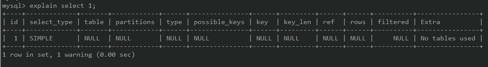

# MySQL 调优

## 1.EXPLAIN [参考](https://www.cnblogs.com/xuanzhi201111/p/4175635.html)

> 查询语句经过优化器后, 会生成一个执行计划. 通过`EXPLAIN`可以查看某个查询语句的`执行计划`.

- `EXPLAIN`出来的信息有 10 列，分别是:
  - `id`: `SELECT` 查询的标识符. 每个 SELECT 都会自动分配一个唯一的标识符.
  - `select_type`: SELECT 查询的类型.
- `table` : 查询的是哪个表;
- `partitions` : 匹配的分区
- `type` : **比较重要, 表明对表的访问方法**:
  - `ALL`：遍历全表以找到匹配的行, 用不到索引, 其他类型都能使用索引.
  - `const`: 主键或者唯一索引等值匹配时.
  - `eq_ref`: 类似 ref，区别就在使用的索引是唯一索引，对于每个索引键值，表中只有一条记录匹配，简单来说，就是多表连接中使用 primary key 或者 unique key 作为关联条件
  - `ref`: 表示上述表的连接匹配条件，即哪些列或常量被用于查找索引列上的值
  - `range`: 使用索引获取某些**范围区间**记录.
  - `index`: 可以使用覆盖索引.
- `possible_keys`: **此次查询中可能选用的索引**;
- `key` : **实际查询中确切使用到的索引**.
- `key_len`: 索引长度, 精度满足, 越短越好
- `ref` : 哪些列或常量被用于查找索引列上的值
- `rows` : **估算的找到所需的记录所需要读取的行数**
- `filtered` : 表示此查询条件所过滤的数据的百分比
- `Extra`: 额外的信息

  - `Using filesort`: 需要额外的步骤来对返回行排序, 需要优化;
  - `Using temporary`: 使用了临时表, 需要优化;
  - `Select tables optimized away`: 通过索引一次性定位到数据行完成整个查询;

## 2.内部执行原理

### 1.count

- 聚合函数, 逐行判断, 如果count参数不是`NULL`, 累计值加1.
    - `count(*), count(1), count(id)`都是计算行数.
    - `count(字段)`: 计算字段不为`NULL`的行数
- 因为要判断字段是否为`NULL`, 所以, 不同`count`性能存在差异. 效率比较:`count(字段)<count(主键)<count(1)==count(*)`

### 2.排序

- MySQL会给每个线程分配一块内存用于排序, 称为`sort_buffer`.

### 3.如何使用join

- 应该使用小表最为驱动表.
    - 表的大小是各自按照查询的过滤条件, 筛选后的大小.
- 分析语句, 如果被驱动表可以使用索引, 使用就没有问题. 如果`explain`结果显示`Block Nested Loop`字样, 扫描的行数过多, 会导致问题. 尽量不要使用.

### 4.主键的自增

- 参数:
    - `auto_increment_offset`: 控制自增初始值.
    - `auto_increment_increment`: 控制自增步长.
- 自增只保证递增, 不保证连续.
- 

## 2.慢查询日志

- 通过配置开启慢查询日志;
- 慢查询相关配置:

- `slow_query_log`: 是否开启, `ON/OFF`;

- `slow_query_log_file`: 日志路径;

- `log_queries_not_using_indexes`: 记录无索引查询, `ON/OFF`;

- `long_query_time`: 慢查询时间阈值;
- 通过`mysqldumpslow`工具, 分析慢查询日志, 找到具体需要优化的 sql 语句;
- 通过`EXPLAIN`语句, 分析具体执行计划, 优化 sql 语句;

## 3.使用及表结构上的优化

- 使用`EXPLAIN`查看如何执行 SELECT 语句;
- 存储过程比单条执行快速, 可以将常用操作转换为存储过程;
- 不检索不需要的数据;
- **子查询需要建立临时表, 效率低, 连接查询不需要建立临时表, 可以用连接查询替代子查询**;
- 表拆分: 当表数据量大时, 查询数据的速度会很慢; 对于某些字段使用频率很低的表, 可以进行拆分;
- 减少链表查询:
  - 增加中间表
  - 增加冗余字段

