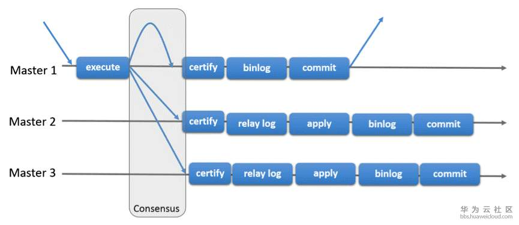

## 1.MySQL集群简介

-   MGR: MySQL Group Replication, MySQL官方于2016年12月推出的一个全新的高可用于高扩展解决方案, 5.7以上版本支持;
-   PXC
-   MHA: Master High Availability, 

## 2.MGR 

>   参考: [MySQL集群MGR架构]([https://www.93bok.com/MySQL%E9%9B%86%E7%BE%A4MGR%E6%9E%B6%E6%9E%84for%E5%8D%95%E4%B8%BB%E6%A8%A1%E5%BC%8F/](https://www.93bok.com/MySQL集群MGR架构for单主模式/)), [MySQL组复制](<http://mysqlhighavailability.com/mysql-group-replication-a-quick-start-guide/>), [MySQL Group Replication解析](<https://bbs.huaweicloud.com/blogs/115356>)

### 1.概述

#### 1.组复制

>   组复制是一个通过消息传递相互交互的server集群, 通信层提供了原子消息和完全有序信息交互等保障机制

-   复制组由多个`server`成员构成, 对所有RW事务只有在冲突检测成功后才提交, RO事务不需要冲突检测;

-   组复制是一种`share-nothing`的复制方案, 其中每个server成员都有自己的完整数据副本;

    -   `share nothing`: 不存在资源共享, 各处理单元通过协议通信;
    -   `share disk`: 各处理单元具有私有的CPU, Memory, 共享磁盘系统;
    -   `share everthing`: 共享磁盘和内存中的数据;

-   组成员间需对事务达成一致意见, 还需要对组成员更新达成一致意见;

-   协商通过`Paxos`算法实现, 保证数据库集群节点数据强一致;

    

#### 2.模式

-   单主模式: 只有主节点可读写, 组中其他成员被自动设置为只读模式;
    -   如果主服务器从组中移除, 将按照顺序从组成员中选择主节点;
-   多主模式: 成员间无差异, 均可读可写;

#### 3.Paxos算法

>   一种基于消息传递且具有高度容错特性的**一致性算法**
>
>   参考: [知乎](<https://www.zhihu.com/question/19787937>), [wiki]([https://zh.wikipedia.org/wiki/Paxos%E7%AE%97%E6%B3%95](https://zh.wikipedia.org/wiki/Paxos算法))

-   通过Paxos算法, 使每个参与者达成一致意见;

### 2.操作

-   配置文件:

    ```ini
    [mysqld]
    # Group Replication 相关配置
    
    server_id = 1                       # server id
    gtid_mode=ON                        # 全局事务
    enforce_gtid_consistency=ON         # 强制GTID一致 
    master_info_repository=TABLE        # master.info元数据保存在表中
    relay_log_info_repository=TABLE     # relay.info元数据保存在表中
    binlog_checksum=NONE                # 禁用二进制日志事件校验
    log_slave_updates=ON                # 级联复制
    log_bin=binlog                      # 二进制日志
    binlog_format=ROW                   # 二进制日志格式
    
    transaction_write_set_extraction=XXHASH64
    loose-group_replication_group_name="aaaaaaaa-aaaa-aaaa-aaaa-aaaaaaaaaaaa" # 组名
    loose-group_replication_start_on_boot=OFF                                 # server启动时, 不自动启动组复制
    loose-group_replication_local_address= "192.168.56.101:33061"             # 本机的组传入连接
    loose-group_replication_group_seeds= "192.168.56.101:33061,192.168.56.102:33061,192.168.56.103:33061"          # 组成员
    loose-group_replication_bootstrap_group=OFF                               # 不启用引导组
    ```

-   在所有节点上安装MGR插件并创建并设置复制帐号

    ```sql
    # 安装MGR插件
    mysql>INSTALL PLUGIN group_replication SONAME 'group_replication.so';
    
    # 设置复制账号
    mysql> SET SQL_LOG_BIN=0;
    mysql> CREATE USER repl@'%' IDENTIFIED BY 'repl';
    mysql> GRANT REPLICATION SLAVE ON *.* TO repl@'%';
    mysql> FLUSH PRIVILEGES;
    mysql> SET SQL_LOG_BIN=1;
    
    mysql> CHANGE MASTER TO MASTER_USER='repl', MASTER_PASSWORD='repl' FOR CHANNEL 'group_replication_recovery';
    ```

    