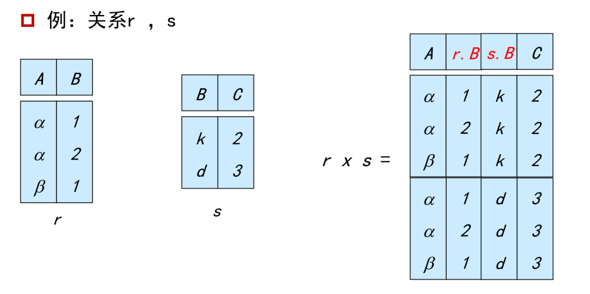
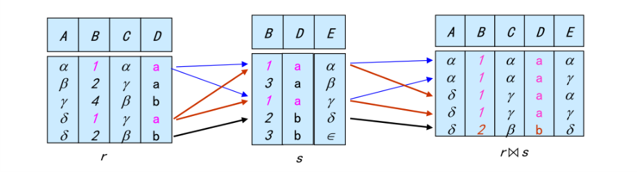
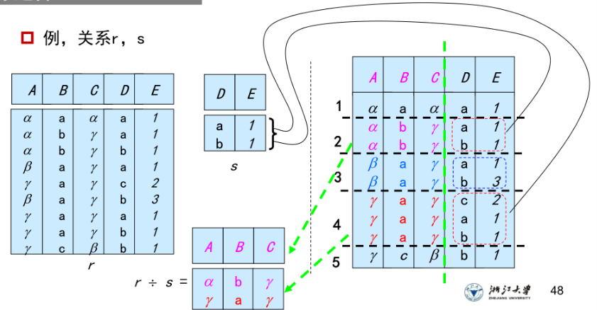

## 1.关系模型

> 关系模型是采用二维表格结构表达实体类型及实体间联系的数据模型.
>
> 联系: 一些实体之间的关联;
>
> 关系: 一种数学概念, 指的就是表;

- 属性: 
  - 每个属性都有一个名称;
  - 域: 每个属性的取值集合称为属性的域;
  - 属性值必须是原子的;
- 关系:
  - 关系模式: 描述关系的结构,例如`Instructor-schema= (ID: string, name: string)`
    - 由多个属性组成;
  - 关系实例: 表示一个关系的特定实例, 也就是所包含的一组特定的行;
    - 由表指定;
    - 一个元组(tuples) 代表表中一行;
    - 元组的顺序无关紧要, 但关系中不能有重复的元组;
- 码, 键
  - 超码: 值能够在一个关系中唯一地标志一个元组;
  - 候选码: 最小超码,任意子集都不能成为一个超码;
  - 主键:  用户明确定义, 并且为一个候选码;
  - 外键: 也成为外码, 

### 1.关系代数

> 六个基本运算: Select 选择, Project 投影; Union 并; Set Difference 差; Cartesian product 笛卡尔积; Rename 重命名; 
>
> 附加运算: Set intersection 交; Natural Join 自然连接; Division 除; Assignment 赋值;
>
> 扩展关系代数运算: 1.广义投影, 2.聚集函数, 3.外连接

- 选择: 执行选择时, 选择条件必须是针对同一元组中的相应属性值带入进行比较; 
- 投影: 选择若干属性,作为保留列,并删除重复行;
- 广义笛卡尔积:  如果属性有交集, 必须重命名这些有交集的属性;

- 自然连接: 1.r,s必须含有共同属性, 2.连接两个关系中同名属性值相等的元组; 3.结果是二者属性集的并集,但消去同名属性;

- 除: 适用于包含了"对所有的"此类似的查询:

- 广义投影: 允许在投影列表中使用算术函数来对投影操作进行扩展,
- 聚集函数(聚合函数): 返回平均avg, 最小, 最大, 总和, 数量等;

- 外连接: 连接运算的扩展, 连接是只保留符合连接条件的信息; 而外链接包含了不符合条件的信息, 不知道或不存在的值用空值代替;
  - 左外连接: 保留左表多余信息;
  - 右外连接: 保留右表多余信息;
  - 全外连接: 左右表都保留;

### 2. 空值处理

